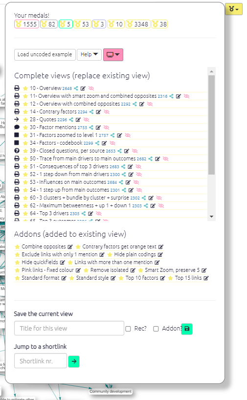
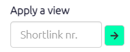
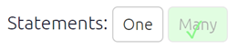
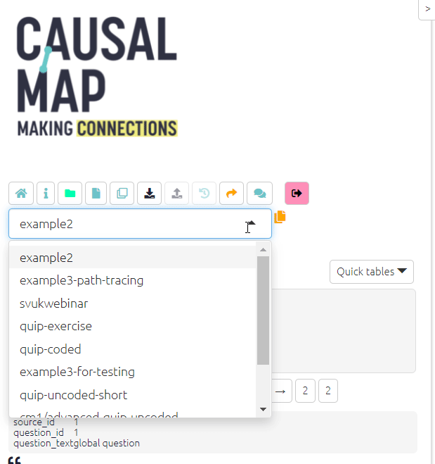
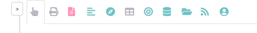

#  Your first 5 minutes with Causal Map{#x5}

Let's have a look around the Causal Map app.

## Quick tour of the app{#quick-tour}

```{r,echo=F}
knitr::include_url("https://player.vimeo.com/video/674369121")

```

## The Dashboard{#xdashboard}




The Dashboard appears on the right as the app loads. 

Each item in the dashboard is a different view of the current file saved by you or other users. 

Each view might apply a particular filter, e.g. "show me only causal claims made by women" and/or take you to a particular tab on the right hand side -- the Print map, one of the Tables, etc.

To load one of the views, just click on the item. 

You can also go to a view if you know its unique number. So to go to view 369, type 369 into this box

 and click the green arrow button.

Maps which have been downloaded as an image often have a unique number like this in the bottom left-hand corner. 


## The left-hand side{#xlhs}

The app has two parts, the [left-hand side](#xlhs) and the [right-hand side](#rhs).

### Do some coding (view one statement) or do some analysis (view many statements)?{#xstatement-view}

{max-width=650}

These buttons add the correct filters to either view just one statement or many statements. 

When you are coding, you will want to view just one statement, and when you want to explore and analyse the entire causal map or sections of it, you will want to view many statements. 

(Even when you are viewing one statement, it is still possible to apply filters for example if the map associated with this one statement is quite large.)

If you have just loaded the app without clicking on a link, you will be taken to an example file called `example-file`. Other public files or files which have been shared with you are listed in the dropdown menu at top left.

{width=650}


Once you load a file you can see how data has been [coded](#xcoding-panel), look at transcripts using the ['book' buttons](#xstatement-nav), or create your own maps using the dashboard or, if you are feeling adventurous, the [filters](xintro-filters).

You won't be able to change anything if you have View Only access to a file, but you can still have a play with the [filters](#xintro-filters) and [tables](x#all-tables).

And if you want to try coding give it a go with the help of the [coding section](#xcoding-panel)!


## The right hand side{#rhs}




Most of the tabs on the right-hand side of the app present the file, with the same filters, in different ways. There are two different kinds of graphical map and other outputs like [tables](https://guide.causalmap.app/all-the-tables.html). Click on the tabs to explore them.

### Interactive View{#not2}

An interactive version of the map in which the elements can be moved around and also the upstream and downstream factors are highlighted when the user moves their mouse over them.

The Interactive View is designed to let you interact with and explore your map, whereas the main point of Print View is to get something high quality and static for including in reports.

### Print View{#not}

A print-quality version of the map with advanced layout.

### Factor editor{#no-not-this-one}

Simply click on the factor you want to change and edit it. You can change one factor everywhere in the file or you can do it for each statement, by pressing the Split checkbox. Just remember to press update once you have made your changes and you are happy with them.

These are the other tabs:

- [Files tab](#xfile-manager)

- [Updates tab](#xupdates-tab)

- [Data tab](#xdata-manager)

- [Account tab](#account-tab)

