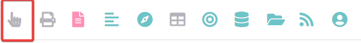
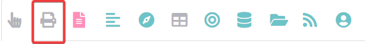
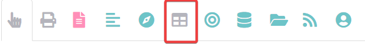
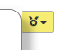

#  Your first 5 minutes with Causal Map{#x5}

Let's have a look around the Causal Map app.

## Quick tour of the app{#quick-tour}

```{r,echo=F}
knitr::include_url("https://player.vimeo.com/video/674369121")

```


The app has two parts, the [left-hand side](#xlhs) and the [right-hand side](#rhs) as well as the [top menu](#xtop-menu).


Whenever you use the app, you are always working with exactly one file, the "current file". 

The top menu contains tools for managing the current file, for instance to restore earlier versions of the file. 

Most importantly, the top menu contains the "file dropdown menu" shown here. You use it to select what file you want to view or code. 


{width=650}

If you have just loaded the app without clicking on a link, you will be taken to an example file called `example-file`. Other public files or files which have been shared with you are listed in this dropdown.

If a file has this symbol, you can edit it, e.g. you can continue to code it.

If a file has this symbol, you can view and analyse it but not edit it.

If a file has this symbol, you can not edit it but you can make a copy which you can then edit.

## Coding a file

If you want to practice coding, you will mostly use the left hand side of the app. You usually start off with an uncoded example file which the app creates for you. You can find it in the dropdown menu, it has a name like **example-file-uncoded-youremailaddress**. 

### Multiple statement selector{#xstatement-view}

{max-width=650}

These buttons add the correct filters to either view just one statement at a time or many statements. 

When you are coding you should click One to view just one statement at a time. Then you will see the navigation bar displayed below.


You can use the arrow buttons to skip through statements. The --> button takes you to the next statement.

## Viewing and analysing a file

Analysing a file means 

- applying different filters to it, so that instead of seeing the entire unfiltered causal map, which can be quite bewildering, you see only part of it, for example

  - show me only information given by women

  - show me only information from the first statement

  - show me only the most frequently mentioned factors.

- viewing the results in different ways by clicking on different tabs in the right hand side, e.g.:

  

  - two different kinds of graphical map
    - the interactive view
    - the print view
  - various [tables](https://guide.causalmap.app/all-the-tables.html). 

If you want to view / analyse a file, you will mostly:

- use the right-hand side of the app and the Dashboard
- view many statements at a time by clicking `Many` on the multiple statement selector (above). 
- start off by analysing the [example-file](https://app.causalmap.app/?story=example-file&filters=&tab=Interactive&subtab=&version=none&tabl=).

### Interactive View{#not2}



[An interactive version of the map](#xinteractive-view) in which the elements can be moved around and also the upstream and downstream factors are highlighted when the user moves their mouse over them.

The Interactive View is designed to let you interact with and explore your map.

### Print View{#not}



[A print-quality version of the map](#xprint-view) with advanced layout. You usually use Print View to get high quality static outputs for including in reports.

### Tables



Use this tab to produce a wide variety of [tables](https://guide.causalmap.app/all-the-tables.html).

### The Dashboard{#xdashboard}

- The Dashboard appears on the right as the app loads, or reveal it by pressing the yellow button at top-right: 


Each item in the dashboard is a different view of the current file saved by you or other users. 

Each view usually:

- applies a particular **filter**, e.g. "show me only causal claims made by women".
- and/or it may take you to a particular **tab** on the right hand side -- the Print map, one of the Tables, etc.

To load one of the views, just click on the item. 

You can also go to a view if you know its unique number. So to go to view 369, type 369 into this box

 and click the green arrow button.

(Maps which have been downloaded as an image often have a unique number like this in the bottom left-hand corner. )

### The other tabs

There are other tabs on the right hand side. You won't need these when you are just getting started.

- [Factor Editor](#xfactor-editor) make advanced edits to your factor labels.

- [Files tab](#xfile-manager) manage all your files.
- [Updates tab](#xupdates-tab) see activity on your files.

- [Data tab](#xdata-manager) see summary data about the current file such as number of factors

- [Account tab](#account-tab) manage your subscriptions and teams.

