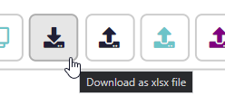
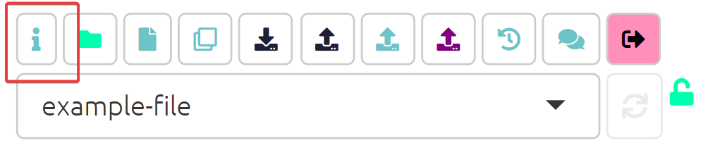

# Getting help

## Tooltips

You can get information about most of the buttons in the app by hovering your mouse over the button for a couple of seconds.

## Blue info buttons

You can get help at any time by clicking on the little blue info buttons, like below. This will then open a panel displaying the relevant section of this guide.

## Help button

{width=650}

The details of what you may differ slightly depending on the version of the app you are using.

## Support chat

You can also usually get live help on these WhatsAp

- [WhatsApp group for Causal Map](https://chat.whatsapp.com/KwWn0lfpHuR0qJKtkuGZUA)
- [Whatspp group for StorySurvey](https://chat.whatsapp.com/CdlkCKV8bP7ATYc4nioL0T)
