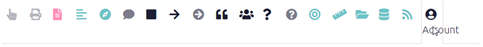
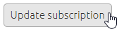

#  Managing your subscription{#xmanage_your_subscription}

To manage, cancel or renew your subscription follow the these steps, go to the Account tab in the app.

  {width=650}

The accounts tab will show you:
	-Details of any teams you manage
	-Any teams you are a member of
	-Files you have created
	-Your subscription

To change your subscription click the update subscription button at the bottom of the page

{width=650}

From here you can renew, cancel or change your subscription. 
