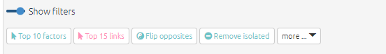

#  Quick tour of the app{#quick-tour}

```{r,echo=F}

knitr::include_url("https://player.vimeo.com/video/674369121")

```

The app has two parts, the [left-hand side](#xlhs) and the [right-hand side](#rhs).

You can get help at any time by clicking on the little blue info buttons, like below. This will then open a panel displaying the relevant section of this guide.

{max-width=650}

## The left-hand side{#xlhs}

### Getting data into the app

- Create a new file 
  - and then upload a map in the form of an [Excel file](#xuploading-and-updating) (.xls or .xlsx).

- Or, in the file chooser, select any files to which you have access, which include an anonymised dataset from a [QuIP](http://bathsdr.org/) study.

### Commands and buttons to apply filters to your map

The left-hand side of the app really only contains the text in the Advanced Editor (which you can view if you want, but close the window if it scares you).

{max-width=650}

The text window uses a simple syntax for filtering and manipulating the maps and tables.

Nearly all the other buttons on the left-hand side are just ways to manipulate this text. Each line in this window is a filter which manipulates the existing map in some way. The lines in the windows are applied successively to the original map to produce the final map which is then displayed.

### Do some coding (view one statement) or do some analysis (view many statements)?{#xstatement-view}

{max-width=650}

These buttons add the correct filters to either view just one statement or many statements. 

When you are coding, you will want to view just one statement, and when you want to explore and analyse the entire causal map or sections of it, you will want to view many statements. 

(Even when you are viewing one statement, it is still possible to apply filters for example if the map associated with this one statement is quite large.)

### Top row

Most people like to hide these filters when they are coding, so they hide the filters using the toggle.

{max-width=650}

But for analysing your map, you will want to open the filters panel.

### Shortcut buttons

These buttons offer quick ways to add filters without going through a dialog panel.

### The filter buttons

There are in three sections: analysis, conditional formats and simple formats. See the section on [filters](https://guide.causalmap.app/all-the-filters.html).

###  if(T) readLines("Guide-to-causal-mapping.Rmd") %>%   str_match(".*vimeo\\.com.*") %>%   keep(~!is.na(.)) %>%   unique %>%   paste0("```{r,echo=F}\n",.,"\n```\n") %>%   c("# Video list{#xvideo-list}\n\nThese videos are all included at different points in the Guide. If you love videos, here they are again in one place. Feel free to binge.",.) %>%   writeLines("00195-video_list.rmd")​{r,echo=F}

To see additional information about the statement you are currently viewing such as the `source_id` and `question_id` slide the info toggle.

## The right hand side{#rhs}

{width=650px}


### Interactive View{#not2}

An interactive version of the map in which the elements can be moved around and also the upstream and downstream factors are highlighted when the user moves their mouse over them.

The Interactive View is designed to let you interact with and explore your map, whereas the main point of Print View is to get something high quality and static for including in reports.

### Print View{#not}

A print-quality version of the map with advanced layout.

### Factor editor{#no-not-this-one}

Simply click on the factor you want to change and edit it. You can change one factor everywhere in the file or you can do it for each statement, by pressing the Split checkbox. Just remember to press update once you have made your changes and you are happy with them.

### Tables

Several tables showing lists of factors, links and various metrics and which can be filtered and reorganised in marvellous ways. See the section on [tables](https://guide.causalmap.app/all-the-tables.html).

- [Files tab](#xfile-manager)

- [Updates tab](#xupdates-tab)

- [Data tab](#xdata-manager)

- [Account tab](#account-tab)

