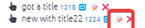
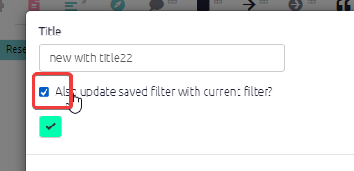
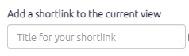
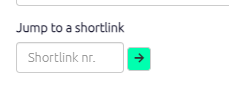
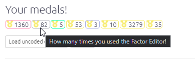

#  The Dashboard{#dashboard}

The Dashboard appears on the right as the app loads. (It is an easier-to-use version of the old "Gallery".) You can also reach the dashboard by pressing the 🏅 icon on the right, or with the key combination Alt+q. 

The Dashboard lists views of the current file saved by you or other users.

When you first create or copy a file, Causal Map will create for you some recommended views. These are marked with a star. 

- You can edit them later, or hide them if you don't want them. 
- Some recommended views might not be shown in the list if they would not be relevant to the current file -- for example if you do not use hierarchical coding, views which are only relevant to zooming are not shown. Occasionally you might see them appear later as you add features to your file, for example if you add hierarchical coding. 
- Occasionally you might see additional recommended views added to the list as we publish new ones.

### Actions -- Click on:

- a row to load the associated filters into the current file.
- the blue number to open the view in an other tab.

- Copy icon: Copy the link and filter for pasting into a document or sending to someone. 
- Edit icon: Edit the filter - see below.
- Hide icon: Hide this row in future from this table (the links will not be deleted).  You may want to use this button to clear unused views from your table. It has no effect on history filters.

## Format snippets

When you click on a view, you will see a version of the current file which usually included analysis filters which change the map itself, for example show only the most frequent links, or zoom out to the top level of a hierarchy. If you are looking at the Advanced Editor, you will see that the entire contents of the editor are replaced.

Snippets are different as they only contain formatting information (conditional and simple formatting) are added after any other existing filters. 

### For admins: the Recommended and Custom shortlinks

Standard views can only be added / edited by admins.  They are not related to specific files but should be applicable to almost any file.  If you send someone a Standard shortlink and they click on it, they are always taken to the standard file. That means, if you use a Standard view on some other file and want to send someone a link to that view on that other file, you need to create another shortlink.  This is also a protection for you, because Causal Map admins might occasionally refine the contents of Standard views, whereas if you make your own shortlink, only you can edit it later.

🧪 Views are not shown if they do not make sense for the current file, for example zooming views are not offered for files which do not contain hierarchical coding. 

🧪 At the moment, on the Tokyo server, on all files except the standard coded file, the button to copy a shortlink to a standard filter is disabled.

The Custom shortlinks are related to the current file. So they might for example contain filters which refer to factors or fields specific to the current file. If you send someone a Custom shortlink and they click on it, they are taken to that same file. 

#### To edit the content (filter, tab etc) of an existing filter:

Set up the content the way you want it in the app, so it looks exactly the way it should when someone in the future clicks on the link. Then go to the filter which you want to update and press the edit button: 

In the modal dialog which opens, make sure you check this box. You can optionally change the title too.

If all you want to do is change the title, make sure the checkbox is **not** checked.

### Adding a shortlink

Set your map or table up the way you want it then put an (optional) title and press Save. The shortlink will also be copied into your clipboard so you can paste it straight into a document or send it to someone else.

### Jumping to a shortlink

If you know the number of a shortlink for the current file, just paste the number in this box and press the arrow.  

### Medals

This section gives a whole load of medals to reflect all the work you've been doing and encourage you to try out new things. 
