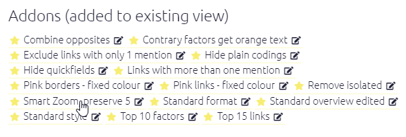

#  The Dashboard{#dashboard}

The Dashboard appears on the right as the app loads. (It is an easier-to-use version of the old "Gallery".) You can also reach the dashboard by pressing the 🏅 icon on the right, or with the key combination Alt+q. 

The Dashboard lists views of the current file saved by you or other users. 

### What's in a View

A View records information about the currently applied filters (analysis filters and formatting) as well as the specific tab you are looking at and, in the case of tables, the way you have set up the table as well. They also save the name of the current file.

### Using and sharing a view{#xsharing_view} 

Click on:

- A **row** to load the associated filters into the current file.
- **The blue View number** to open the view in an other tab.
- **`Share` icon**: Copy the link and filter to your clipboard, for pasting into a document or sending to someone. If you send someone a shortlink to a view, when they click on it they will be taken to the *same view of the current file* (providing you have given them View or Edit rights to the file).
- **`Edit` icon**: Edit the view - [see below](#xedit_view)
- **`Hide` icon**: Hide this row in future from this table.  You may want to use this button to clear unused views from your table. If you already shared this link with someone, it will still work even though it is hidden.

### ⭐ Recommended views versus 🤵custom views

#### ⭐ Recommended views

When you first create or copy a file, Causal Map will create for you some recommended views. These are marked with a star. 

- These recommended views are copies specific for the current file. You can edit them later, or hide them if you don't want them. 
- Some recommended views might not be shown in the list if they would not be relevant to the current file -- for example if you do not use hierarchical coding, views which are only relevant to zooming are not shown. Occasionally you might see them appear later as you add features to your file, for example if you add hierarchical coding. 
- Occasionally you might see additional recommended views added to the list as we publish new ones.

#### 🤵 Custom views - create your own 

You can create your own views for the current file at any time. 

Set your map or table up the way you want it then put an (optional) title and press Save.

- A shortlink to this view will also be copied into your clipboard so you can paste it straight into a document or send it to someone else. 
- If you put a title, the view will also appear in the list of views for the current file. 
- If you don't put a title, it won't be listed, but the shortlink you created will always point to that same view. 

## Complete views versus "Add-ons" 

Complete views replace the existing view and all the filters, included for example analysis filters which change the map itself, for example show only the most frequent links, or zoom out to the top level of a hierarchy. If you are looking at the Advanced Editor, you will see that the entire contents of the editor are replaced.

"Add-on" views are are added after any other existing filters and do not replace them. So you can use them for example to add a particular kind of formatting, like making all the links pink, or to add one instruction, like "remove all links mentioned only once".

{width=650}

Complete views belong with the current file and you can edit them, whereas Add-ons exist separately of individual files (actually, they belong to `example-file`) and you can't edit them (unless you are an admin). 

## To edit the content (filter, tab etc) of an existing view:{#xedit_view}

Set up the content the way you want it in the app, so it looks exactly the way it should when someone in the future clicks on the link. Then go to the filter which you want to update and press the edit button: 

{width=650}

In the modal dialog which opens, make sure you check this box. You can optionally change the title too.

{width=650}

If all you want to do is change the title, make sure the checkbox is **not** checked.

## Applying a view
{width=650}

When you view a map which has been downloaded as an image you will see there is a unique number in the bottom left-hand corner. Using this number you can jump to this particular view on that specific file, just paste the number in this box at the bottom of the dashboard and press the arrow. If you share this number with others who have edit or view access they will also be taken to this view.

## Medals

This section gives a whole load of medals to reflect all the work you've been doing and encourage you to try out new things. 

## For admins

Recommended views can only be added / edited by admins, and only from `example-file`. 

When you create a recommended view it should be applicable to almost any file, so don't use filters which refer to particular factor labels etc.  

Recommended views are then copied to every other file. Editors can then edit, rename etc that recommended filter in the other file. But that won't change the original filter in `example-file`.  Editors can hide a recommended filter in any other file except  `example-file`, and it won't come back.

Addons work a bit differently from complete views - they can also only be created within  `example-file`, but they are not copied to other files. As admin, you can create your own addons just for individual files if you want, by not clicking "recommended" -- maybe useful if you have a lot of steps you want to repeat just within a particular file.

To "delete" an addon, edit it and delete the title. 

