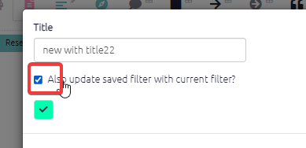

#  The Gallery{#gallery}

The Gallery loads as the app loads and gives you the opportunity to jump to another file and/or filter before loading the file which was already loading.

You can use it as a dashboard from which you can check out and revisit your previous work and get ideas from others.

You can also reach this dialog by pressing the 🏠 icon in the top menu, or with the key combination Alt+q. 

The Gallery contains the history of all the filters you used in the current session as well as filters from shortlinks saved by you or other users. Search to find the filters you need. For example, if you want to get some ideas for using the `combine opposites` filter, start to type "combine opposites " in the Search box on the left or (if you want to be more precise) in the search box above the `filter` column. This will show you examples from your own history or from when others have saved a filter in different projects. Then you can either load just that filter into your current file or go to see how that filter works in the file where it was used. 

 

### Action buttons

- Load & File: load this file and then load this filter
- Load: Apply this filter to the current file. 
  - Sometimes the filter might need some tweaking, especially if it refers to specifics like factor names or features of sources like "location" which are not the same in the two files.
- Append: Add this filter at the bottom of the existing filters
- Copy: Copy the link and filter for pasting into a document.
- Hide: Hide this row in future from this table (the links will not be deleted).  You may want to use this button to clear unused shortlinks from your table. It has no effect on history filters.

## 🧪 The new dashboard (documentation is work in progress)

The dashboard when the app loads.

You can also reach this dialog by pressing the 🏅 icon at top right, or with the key combination Alt+q. 

The dashboard contains shortlinks saved by you and other users. 

### The Recommended and Custom shortlinks

Recommended filters can only be added / edited by admins.  They are not related to specific files but should be applicable to almost any file. (Though the shortlink does store the information about what file it was created in.) . If you send someone a Recommended shortlink and they click on it, they are always taken to the standard file.

The Custom shortlinks are related to the current file. So they might for example contain filters which refer to factors or fields specific to the current file. If you send someone a Custom shortlink and they click on it, they are taken to that same file.

### Actions

Click on a shortlink to load the associated filters into the current file.

#### To change the content (filter, tab etc) of an existing filter:

Set up the content the way you want it in the app, so it looks exactly the way it should when someone in the future clicks on the link. Then go to the filter which you want to update and press the edit button: 

In the modal dialog which opens, make sure you check this box. You can optionally change the title too.

If all you want to do is change the title, make sure the checkbox is not checked.

#### To delete an existing filter:

Simply press the red X. There is no warning, so be careful!

## View 1226: Overview

#### To delete an existing filter:

Simply press the red X. There is no warning, so be careful!

## View 1227: Overview and smart zoom

#### To delete an existing filter!

Simply press the red X. There is no warning, so be careful!

