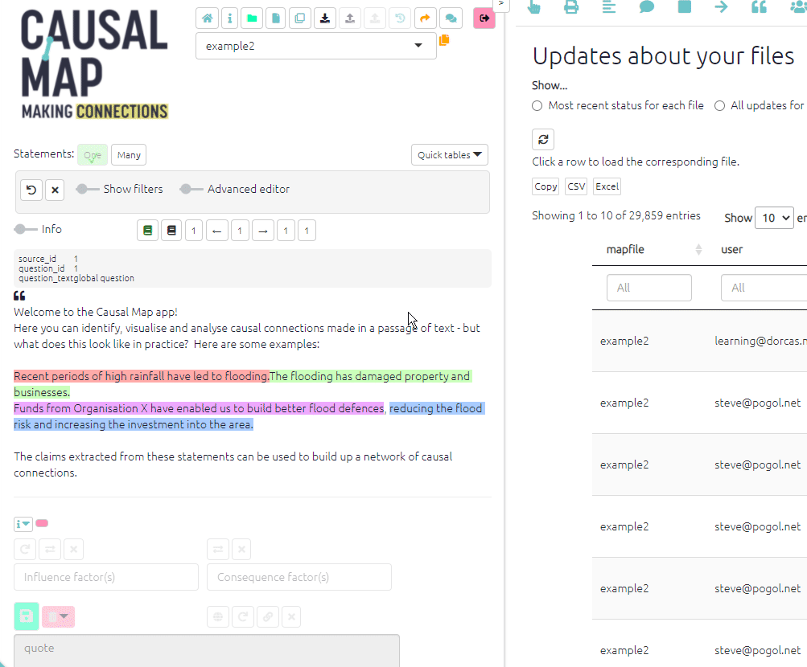

#  The Gallery{#gallery}

The Gallery loads as the app loads and gives you the opportunity to jump to another file and/or filter before loading the file which was already loading.

You can use it as a dashboard from which you can check out and revisit your previous work and get ideas from others.

You can also reach this dialog by pressing the 🏠 icon in the top menu, or with the key combination Alt+q. 

The Gallery contains the history of all the filters you used in the current session as well as filters from shortlinks saved by you or other users. Search to find the filters you need. For example, if you want to get some ideas for using the `combine opposites` filter, start to type "combine opposites " in the Search box on the left or (if you want to be more precise) in the search box above the `filter` column. This will show you examples from your own history or from when others have saved a filter in different projects. Then you can either load just that filter into your current file or go to see how that filter works in the file where it was used. 

 

### Action buttons

- Load & File: load this file and then load this filter
- Load: Apply this filter to the current file. 
  - Sometimes the filter might need some tweaking, especially if it refers to specifics like factor names or features of sources like "location" which are not the same in the two files.
- Append: Add this filter at the bottom of the existing filters
- Copy: Copy the link and filter for pasting into a document.
- Hide: Hide this row in future from this table (the links will not be deleted).  You may want to use this button to clear unused shortlinks from your table. It has no effect on history filters.
