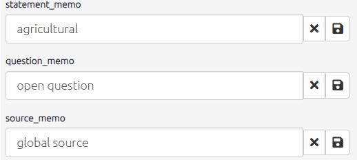

#  The Statement Navigator{#xstatement-nav-old}

When you are looking at one statement at a time, you will see the navigation bar displayed below.

The `info` toggle opens additional statement info, i.e. info for any fields which start with #, for example you might have a field #gender in your statements table. 

Boxes to edit the statement, question and source memos will also appear. Here you can add useful additional data which can be displayed on your map using the [label links](xformatting-links) or [label factors](#xlabel-factors) filters.

{width=650}

By clicking on the green book icon you can see all the statements from all sources or the black book icon will show the transcript from the respondent whose statement you are currently viewing.

{width=650}

You can use the arrow and numbered button to skip through statements. If you want to skip to a particular statement the easiest way is to use the [find statements](xfind-statements-links) filter. This will automatically be applied if you are viewing statements one at a time, so simply click on the filter and edit the number it is searching for.
