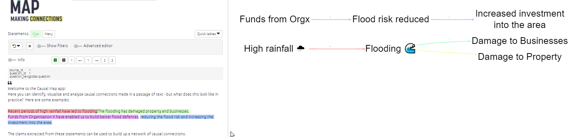

#  Print view{#print-view}

A print-quality version of the map with advanced layout. For a brief summary of the tab please see the [previous section](#xinteractive-view).

When you are viewing a single statement, the colour of the links corresponds to the colour of the highlighted sections of text.

- If you have edit permissions, you can edit a factor by clicking on its label.

You can now change the size of the Print map by using the `+` and `-` (and `Reset`) buttons. You can also drag it around.

To change the format of the print view, use the [set print filter](#xsimple-formats).

### Copying your map as a vector image{#copy-svg}

You can now export your map as SVG using the export SVG button at bottom right.

When you export an SVG image, a shortlink is automatically created for you. The ID of the shortlink is printed in grey at the bottom left of the image, and the link is also copied into your clipboard so you can paste it straight into a report if you want. Anyone who clicks on the shortlink will be taken to the app with the same image with the same filters.

