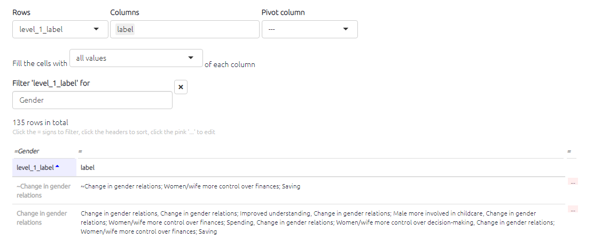
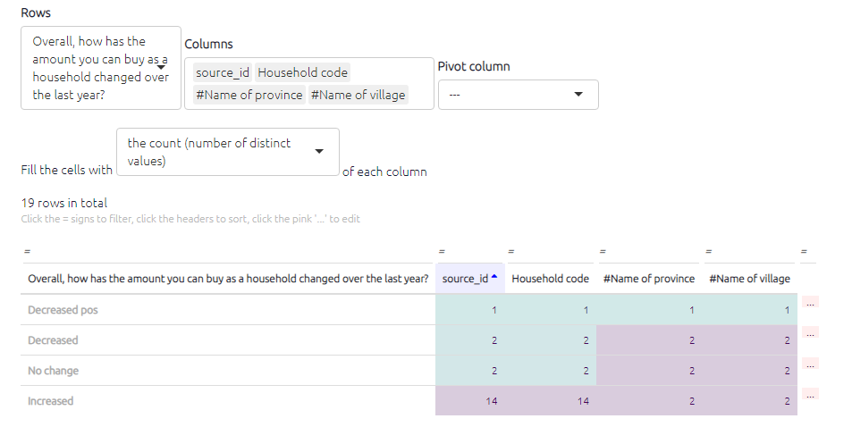

#  All the tables{#xall-tables}


```{r,echo=F}
knitr::include_url("https://player.vimeo.com/video/596519456")
```

From simply creating a table showing the total links to and from each factor to a visual representation of each respondent's response to a closed question. The possibilities are large - and increase with the amount of additional data your project has.

## Presets{#preset-tables}

If you want to keep things simple the presets relevant to each table are accessible from each of the table tabsable, so just click on the button to create that table.

{width=650}

----

## Features common to all the tables{#tables_common}

Numerical tables are presented as *heatmap tables*. The higher the number, the darker the colour of the cell will be.


### Main controls

Each table has a set of controls, which are the same across nearly all the tables.


- When the `Which version` toggle is set as "Filtered", the tables respond to any filters you have applied in the left-hand panel of the app, just as the interactive maps do. The table shows data corresponding to the map as it is currently displayed.
  - If you want to see all the data in one table for the unfiltered map, switch this toggle to Unfiltered.

- You can copy the data from the tables into your clipboard by clicking `Copy` , and then you can then paste the data in Word or Excel to create your own tables, graphs, or visualisations.
- Or save your table as `CSV` or `Excel`.
  - These buttons will export all the data in the current table, including columns which are hidden because you have not put them into the `Show columns` box.

- You can also screenshot the table if you prefer!


### Adding columns, grouping, counting

You can also group the rows in the factor tables to show how the data presented differs between various respondent characteristics such as age, education, and sex. Simply select the desired filter from the Group rows filter.

When you put a field in the `count` box, your table will get an extra final column called `total`:

{width=650px}

### Search

You can search / filter the whole table using the box at top-right. And you can search  / filter individual columns using the individual boxes.  (These boxes are greyed out if all the values in the field are the same so there is nothing to search.)

{width=650px}

You can search a column of numbers by using the slider, or by typing an equivalent range:


... so if you type "15...15" you will search just for the number 15:


### Sorting

You can sort the whole table by any column by clicking on the appropriate header:


### Reordering columns

You can reorder the columns just by dragging the column headers. This can be useful if you need a particular view for a report. The order won't "stick" when you come back to the table.


There's also a catch - if you have columns A B and C, and move column B to position 3, and you want to sort by column B, you have to click on the second column even though column B is now in position 3!

## Print view{#xprint-view-tables}

Do you want some preformatted quotes for your report?


Each table can also be shown as simple text for copying and pasting.

If you want printable quotes for your report, there is a table preset for that. Or go manually to the links table, click the 🖨️ button to display Print View, and choose the columns you want. They will be shown in the Print View in the same order. Then just copy and paste using the "Copy" button.

### Filtering print view of tables

Now you press the toggle for Print View in a table, you can still use the additional table filters to filter the information in your table. This can be really handy, for example for finding the right quote. Don't forget you can also include and exclude the fields which appear in Print View, and change their order, using the Show Columns box. Only the first 100 rows are shown.


## 🧪 New tables

The eight existing tables tabs had various weaknesses:

- Many different tabs

- Ajax errors

- Inconsistent interface and ways of producing different tables, e.g. some have certain filters or types of shading, others don't

- Not possible to export as Excel the same columns as in the current view

- Not possible to consistently restore tables from shortlinks

- Not possible to construct pivot tables

- Hard to write code to handle clicks on rows

### Roadmap

The old tables will continue to function but as they take quite a lot of space and resources we will gradually hide them.

Current limitations of new tables:

- Can only filter by one column (will probably fix this)
- Cannot presently filter numeric columns as numbers

### Familiar functionality with small differences

Hopefully it wont be much different from before, you'll just see some new functionality.

- Select the `Tables` tab and select the table you want from the tables chooser buttons - the same choices as before.

- You can interact with the rows of (some of) the tables as before, but instead of clicking on the row, you click on the three pink dots at the end of the row. (That means you can now also click on the rows as normal e.g. to copy something.)

- You sort columns by clicking on them as before.
- You filter columns by clicking on the = sign above the column you want to filter.
- The "print view" and the help dropdowns work as before.
- You can save to xlsx as before, but now the file includes what you see rather than including additional columns or rows.
- As before, you can view filtered or unfiltered versions of the tables ... there is a subtle difference that the settings such as column selection and number of rows apply to both versions of each table rather than being separate as before -- that should be more intuitive than before.

### New functionality

- You can select font size and table styling
- The `presets` button now brings up a list of all available preset tables, not just for the current table, and it works via the existing dashboard. That means you can also add your own presets for a particular file -- by saving a view as a shortlink.
- The biggest difference is the way you construct your table, which is more powerful and hopefully easier to understand.

#### Constructing your table

There are three possibilties: 

1) Normal table. You simply select the first column you want in the "rows" box and then add any others you need in the "columns" box.  The first column is also formatted a bit differently.

2) Compressed rows: this happens when you select a field for your rows which is "shorter" than the actual number of rows in the table. For example [5043](https://causalmap.shinyapps.io/tokyo/?s=5043)  , in the factors table you can select level_1_label. Because there are fewer of these than there are factors, the table will be "compressed" and we can choose how we want the multiple results for each row to be displayed -- here we have chosen to display all the labels, but we could also have displayed just the number of values.  

   

Here, we compress the sources table just by the answer to their question on purchasing power [5044](https://causalmap.shinyapps.io/tokyo/?s=5044), and display several other columns. 


This is the same thing, but showing just the counts in each cell: [5045](https://causalmap.shinyapps.io/tokyo/?s=5045).



3. Pivot tables

Finally, it is possible to construct pivot tables by selecting a column to pivot by: [5046](https://causalmap.shinyapps.io/tokyo/?s=5046). Again, you can fill the cells with all the values of a field you select, like source_id, or all the unique values, or the counts.


Pivot tables give us lots of new possibilities, like this display of closed questions: [5047](https://causalmap.shinyapps.io/tokyo/?s=5047). 


