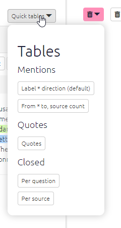

#  All the tables{#xall-tables}


```{r,echo=F}
knitr::include_url("https://player.vimeo.com/video/596519456")
```

From simply creating a table showing the total links to and from each factor to a visual representation of each respondent's response to a closed question. The possibilities are large - and increase with the amount of additional data your project has.

## Presets{#preset-tables}

If you want to keep things simple, try creating a table using one of the quick presets:



... and the presets relevant to each table are also accessible from within that table:

{width=650}

----

## Features common to all the tables{#tables_common}

Numerical tables are presented as *heatmap tables*. The higher the number, the darker the colour of the cell will be.


### Main controls

Each table has a set of controls, which are the same across nearly all the tables.


- When the `Which version` toggle is set as "Filtered", the tables respond to any filters you have applied in the left-hand panel of the app, just as the interactive maps do. The table shows data corresponding to the map as it is currently displayed.
  - If you want to see all the data in one table for the unfiltered map, switch this toggle to Unfiltered.

- You can copy the data from the tables into your clipboard by clicking `Copy` , and then you can then paste the data in Word or Excel to create your own tables, graphs, or visualisations.
- Or save your table as `CSV` or `Excel`.
  - These buttons will export all the data in the current table, including columns which are hidden because you have not put them into the `Show columns` box.

- You can also screenshot the table if you prefer!


### Adding columns, grouping, counting

You can also group the rows in the factor tables to show how the data presented differs between various respondent characteristics such as age, education, and sex. Simply select the desired filter from the Group rows filter.

When you put a field in the `count` box, your table will get an extra final column called `total`:

{width=650px}

### Search

You can search / filter the whole table using the box at top-right. And you can search  / filter individual columns using the individual boxes.  (These boxes are greyed out if all the values in the field are the same so there is nothing to search.)

{width=650px}

You can search a column of numbers by using the slider, or by typing an equivalent range:


... so if you type "15...15" you will search just for the number 15:


### Sorting

You can sort the whole table by any column by clicking on the appropriate header:


### Reordering columns

You can reorder the columns just by dragging the column headers. This can be useful if you need a particular view for a report. The order won't "stick" when you come back to the table.


There's also a catch - if you have columns A B and C, and move column B to position 3, and you want to sort by column B, you have to click on the second column even though column B is now in position 3!

## Print view{#xprint-view-tables}

Do you want some preformatted quotes for your report?


Each table can also be shown as simple text for copying and pasting.

If you want printable quotes for your report, there is a table preset for that. Or go manually to the links table, click the 🖨️ button to display Print View, and choose the columns you want. They will be shown in the Print View in the same order. Then just copy and paste using the "Copy" button.

🧪 Filtering print view of tables

Now you press the toggle for Print View in a table, you can still use the additional table filters to filter the information in your table. This can be really handy, for example for finding the right quote. Don't forget you can also include and exclude the fields which appear in Print View, and change their order, using the Show Columns box. Only the first 100 rows are shown.
