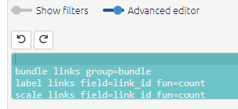
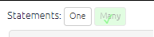

#  Introduction to filters{#xintro-filters}

```{r,echo=F}
knitr::include_url("https://player.vimeo.com/video/618270513")
```

## Commands and buttons to apply filters to your map

The left-hand side of the app really only contains the text in the advanced editor (which you can view if you want, but close the window if it scares you).

{width=650}

The text window uses a simple syntax for filtering and manipulating the maps and tables.

Nearly all the other buttons on the left-hand side are just ways to manipulate this text. Each line in this window is a filter which manipulates the existing map in some way. The lines in the windows are applied successively to the original map to produce the final map which is then displayed.

## Statement Toggle: Do some coding (view one statement) or do some analysis (view many statements)?

{width=650}

This pair of buttons add the correct filters to either view just one statement or many statements. 

When you are coding, you will want to view just one statement, and when you want to explore and analyse the entire causal map or sections of it, you will want to view many statements. 

(Even when you are viewing one statement, it is still possible to apply filters for example if the map associated with this one statement is quite large.)

## Toggles to show and hide filters

Most people like to hide these filters when they are coding, so they hide the filters using the toggle.

{width=650}


But for analysing your map, you will want to open one or the other.

## Restore Filters

This panel is useful for restoring previous filters. 

- On the left is a list of filters you applied previously in the current session. Select the one you want and press the green Restore button.
- On the right is a list of filters which have been saved (by you or someone else) for the current file, as well as the date and time and the ID of the user. Select the one you want and press the green Restore button. So you can use the shortlink button not only for sharing with others but also for saving your favourite filters for this file. 


## Shortcut buttons

{width=650}

These buttons offer quick ways to add filters without going through a dialog panel.

## The filter buttons

The filter buttons are in three sections: analysis, conditional formats and simple formats.

You will find the filters that are activated in the white bar just below their section heading labelled `active`. You can click these buttons to edit, rearrange the order or delete the filter.

All analysis buttons are in the bar below, labelled `all`. You will find a tick on the button if it has been activated. With the analysis filters you can click on the filters in the bar to activate them again.

{width=650}
