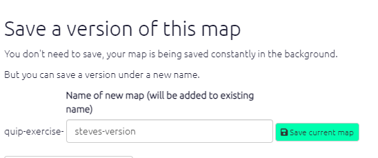

#  The top menu{#xtop-menu}

For more details on the top menu, see [here](#x-top-menu-advanced).

This page is all about how to manage using the top menu to help you deal with the currently loaded file. Hover over the icons to see what they do.

{width=650}

There is also a dedicated [File Manager](#file-manager) to manage all your files.


## Making your own copy of a file


```{r,echo=F}
knitr::include_url("https://player.vimeo.com/video/641927229")
```
Copying a file in Causal Map is easily done. Simply load the file you want to copy using the dropdown menu. Then click the 'Save As' button on the top left of your screen. 

{width=650}

You can then append something to the end of the filename to make it yours:

{width=650}

Click the 'Save' button. This window will then close and your copy of the file will load up. You can now make changes to this new file. 

The other buttons help you with these tasks:

- Restoring a previous version of your file
- [Uploading your data ](#ximport)
- Managing the current file, for example to share it with others.

