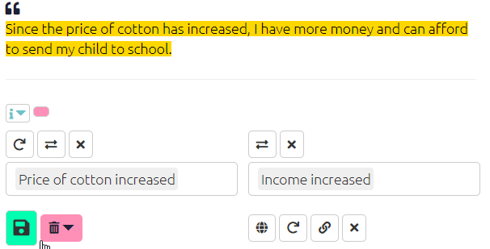

#  The Coding Panel: creating factors and links{#xcoding-panel}

Qualitative causal mapping involves taking passages of text, e.g. from interviews or documents, and identifying sections which make causal claims. We highlight each of these sections and specify a causal factor at each end of each link (for example Lost job or Went hungry). This means creating a new factor or reusing an existing one. Usually we create these factors inductively as we code, and revise and review and consolidate them as part of the process, as with any other kind of qualitative content analysis. This section is about how to create factors and their labels.

In Causal Map, a factor *is* its label. Once you create a label, there is nothing else to add.


##  Creating links in the app

```{r,echo=F}
knitr::include_url("https://player.vimeo.com/video/604099226")
```
To code a causal link, - With your mouse, highlight a piece of text within the statement which makes a causal claim.

- Watch how that passage is copied for you into the “Quote” window below. (Usually you don't need to think about his window: you can edit the text if you really need to but it has to remain an exact quote of one part of the text or you will get a warning.) - Start to type the name of the influence factors at the **start** of the link(s) which you are going to make, in the first drop-down menu.
- If there is an existing factor which matches what you want, you can select select it.
- Otherwise you will create a new factor with the contents of what you have typed; finish what you have typed with a comma or a tab character if you want to continue to select or create another factor.
- If you want to create more than one link, you can select or create additional factors in the same box (as shown in the video below).
- When you have finished, press Enter.
- Repeat the process in the other box to specify the factors at the **end** of the link (or ends of the links).
- Press the green Save button which is now active.
- The link is created in the Map window, colour-coded with the quote which is now highlighted on the left. If you mouse over the highlighted quote, the link in the map is activated.

For more information on how to edit an existing link [see here](#xedit-factor-and-links).

This video shows how to create more than one causal link at a time.

```{r,echo=F}
knitr::include_url("https://player.vimeo.com/video/588851236")
```

**NOTE**: factor names which contain semicolons **;**. get special treatment as they separate the different parts of [hierarchical labels](#xhierachical-coding).

After beginning to create links between factors, one will notice already-coded factors will appear in the dropdown menus in the to and from factor boxes. For added convenience: 

- the most frequently coded factors will appear at the top of this list
- if you are using hierarchical coding, top-level components will appear to be selected even if you have not used them explicitly so far. For example, if you have used the factors `health; mental` and `health; physical`, the factor `health` will appear even if you never used it explicitly. You can then easily create new nested factors such as `health; spiritual`by selecting `health` and then typing `; spiritual` with a leading ";". The app will automatically join these for you into the factor `health; spiritual`. 
- once you have selected an influence factor, the order of the choices available for the consequence factor will be silently updated, presenting at the top of the list the most frequently mentioned consequences of the influence factor you have chosen.


##  Chaining Links{#xchaining-links}

```{r,echo=F}
knitr::include_url("https://player.vimeo.com/video/588881701")
```

Chaining links is easily done and useful when you have statement where one consequence leads to another, which leads to a third, and so on. To use this function simply click the chain icon below the consequence factor box and the app will automatically fill the influence box with the consequence from your previous link.

{width=650}


 

## Using memos and hashtags{#xmemosandhashtags}

### Memos{#xlink-memos}

Qualitative coding usually involves making notes and memos, and you can do this in Causal Map too.

This toggle opens both additional statement info, i.e. info for any fields which start with #, for example you might have a field #gender in your statements table, and also shows the boxes to edit the memos. (In this example, there is no additional information.)


### Hashtags / link flags{#xhashtags}

Hashtags are available as a special kind of memo when coding a link: you can use them to provide any kind of additional information, for example:

- about **the causal connection**, e.g.
  - the respondent says this is only true for their village, not for other villages
  - where a link is only projected for the future
- about **the claim about the causal connection**
  - where a link is only a hypothesis
  - to add other qualifying information like “source seems unsure.”
  - respondent doesn’t like this connection 
  - respondent feels good about the outcome.

- for you, the analyst, e.g.
  - respondent is answering a different question 
  - to tag links you want to come back and review. 


As usual in Causal Map, you can apply one or more hashtags, and you can either select existing hashtags or create new ones on the fly.

Later, you can [filter the map](https://guide.causalmap.app/analysis.html#filtering-the-map-by-link-hashtag-memo) to show only links containing specific hashtags (or parts of hashtags), and also for links which do *not* contain specific hashtags or parts of hashtags.

