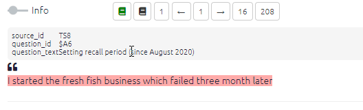
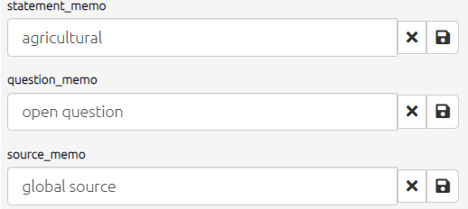

# The info panel{#xinfo-pan} 

This info provides important information about context which you may need to refer to during coding.

During coding, the `info` toggle opens additional statement info. [^1]

[^1]: information is shown for any fields in the statements table which start with #, for example #gender.  

## The memos panel

When you click the toggle switch, boxes to edit the statement, question and source memos will also appear. 

Here you can add useful additional memos on your coding process.

These memos can also be displayed in tables and used to create filters such as "don't show me information from sources with a memo containing the word `doubtful`".

{width=650}

