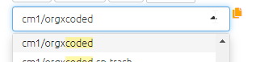
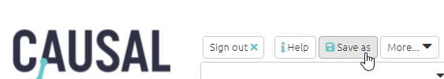

# Moving to Causal Map 2 from Causal Map 1

**Read this if you have been using the legacy version of Causal Map (CM1) at go.causalmap.app**

All your files (and other files you had access to) from CM1 are accessible from within CM2. You will find them in the file chooser dropdown menu as before, but preceded by `cm1/...`

{width=650}

You can view and analyse these files in CM2 without needing to do anything.

You can't make changes to them from within CM2.

If you are still coding a file in CM1, changes you make will be visible from CM2 as soon as you refresh the page.

If you want, you can save a CM1 file in the new CM2 format so that you can continue to edit it in CM2 (as long as you have *edit* or c*opy*, not just *view*, authorisation to the original file- see [here](#xpermissions) for more details). 

{width=650}

This creates a new file which is no longer connected to the original file.

You will find that *coding* with the new platform is pretty much the same as coding in the old one.  The Factor Editor aka multi-editor is still there but on the right hand side. But when it comes to *analysis*, the new app can do much more.

The rest of this [Guide](guide.causalmap.app) will take you on a 🗺 [quick tour](#quick-tour) of the app.

You may also have been using the Causal Map **Viewer** at (https://causalmap.shinyapps.io/CausalMapViewer/). This has been superseded by Causal Map 2.

