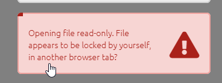
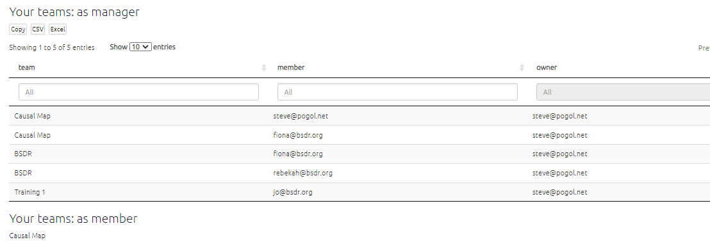

# Collaborating at Causal Map

## 🧪 Collaboration 

You and your colleagues can log in to the same or different maps from the same or different accounts^[depending on your subscription status], including from multiple browser tabs -- so you can have two maps open at once.

*Two different people cannot edit the same file at the same time*. If you open a file which someone else is editing, you will see a warning and the file will be opened for you in view-only (or copy-only) mode. 

To see any changes they make, you will have to refresh the browser tab. 

Similarly, if you have a file open in one tab and open the same file in another tab, you will receive a warning and the second tab will be view-only.

Of course you can work asynchronously (taking it in turns to edit). 

It is also possible to work on two or more separate files separately and then [merge them](xmerging-files).

## Teams

- You can create one or more teams and make other people members of that team
- Other people can include you in their teams
- Each team has an owner and a name, and one or more members
- The names of teams you are a member of appear in sha
- There is a special team called `global`: sharing a file with `global` means that any user of Causal Map gets access.

