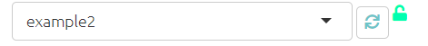
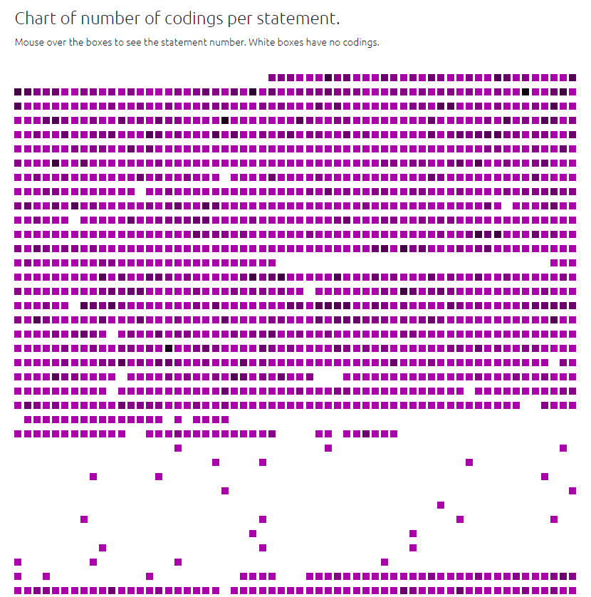

# Collaborating at Causal Map{#collaboratio}

## Collaboration: New functionality.

One feature we've been asked for most on Causal Map is **[live collaborative coding](https://guide.causalmap.app/collaborating-at-causal-map.html#details)**: if only two people could edit the same file at the same time! Well, we've now made that possible.

{width=650}

Up until now, you and your colleagues have been able to log in to the same or different maps from the same or different accounts^[depending on your subscription status], including from multiple browser tabs -- so you can have two maps open at once -- but you couldn't both edit the file at the same time. That's what we have enabled. (Or you can even have the same file open yourself in two different browser tabs if you want). 

So for example if you have a large file with a lot of transcripts, you could start coding, say, statements 1-200, and your colleague can start coding statements 201-400. The factors you create will be available to them and vice versa. 

This will probably later become a premium feature for subscribers to the Unlimited package only, but right now it is free for everyone on the [Tokyo server](https://causalmap.shinyapps.io/tokyo/) only -- let us know (hello@causalmap.app) if you have any questions or comments. 

### Details

If the file was edited elsewhere since you last (re)loaded it, when making changes you will see a notification that your changes will be merged, but everything should just work, for example:

- adding new codings / links / editing existing links 
- deleting or editing links or factors

When your changes are merged, you will have the latest version of everything. Your colleague might not yet have the changes you just made, but the next time *they* make an edit, they will be up to date.

If your file is not up to date with the latest changes, this "refresh" button will be active (usually it is greyed-out). 

If you want, you can press the button to get the latest version, but if you are doing your own edits there is no need as you will see the latest version (plus your changes) when you save changes.

We **don't yet support** doing any of these things while the file is open for in different sessions:

- **using the factor editor** (The "Update" button will be greyed if the contents of the editor are not the newest version of the file -- but really, we don't anyway recommend doing any major reorganisation of your factor labels while someone else is working on the file at the same time!)
- doing advanced file operations like merging or renaming files

It is also still possible to work on two or more separate files separately and then [merge them](xmerging-files).

Don't forget, if two or more colleagues are coding the same file at once, perhaps Jo is coding statements 1-100 and Sam is coding statements 101-200, you can get an overview of what (and how muc) has been coded in the Coding sub-tab of the Reports tab:

##  Collaboration: Standard functionality

You and your colleagues can log in to the same or different maps from the same or different accounts^[depending on your subscription status], including from multiple browser tabs -- so you can have two maps open at once.

*Two different people cannot edit the same file at the same time*. If you open a file which someone else is editing, you will see a warning and the file will be opened for you in view-only (or copy-only) mode. 

To see any changes they make, you will have to refresh the browser tab. 

Similarly, if you have a file open in one tab and open the same file in another tab, you will receive a warning and the second tab will be view-only.

Of course you can work asynchronously (taking it in turns to edit). 

It is also possible to work on two or more separate files separately and then [merge them](xmerging-files).

## Teams

- You can create one or more teams and make other people members of that team
- Other people can include you in their teams
- Each team has an owner and a name, and one or more members
- The names of teams you are a member of appear in sha
- There is a special team called `global`: sharing a file with `global` means that any user of Causal Map gets access.

