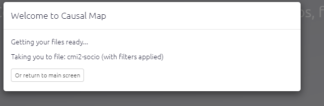
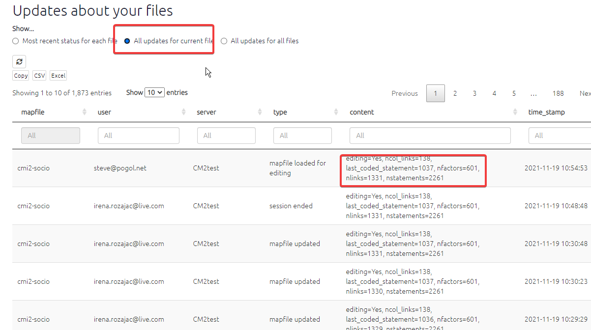

# ⚡ FAQs: Causal Map questions and troubleshooting{#FAQs}

## Logging in

There seems to be a problem with my current file and every time I refresh the page the app kicks me out again
Most likely there is a problem with your current file. Refresh the page, and click the button here as soon as it reloads. 

Wait a little to return to the main screen. Then try to load your file. If you still can't load it, use the blue feedback button on the far right to report the issue to our support team.

I can't log in
If you have the app open in more than one browser tab, close all those tabs and load the app again. If you still can't load it, contact our support team.

## Setting Up

Is there a security audit for Causal Map?

Please see our T&Cs at https://causalmap.app/terms-and-conditions-for-the-causal-map-app/

I've signed up but haven't received a validation code?

Firstly, the best thing to do is double check you have entered your email correctly - if your email is correct, then try sending the code again. Make sure to also check your junk/spam email folder. If none of these things work email us at hello@causalmap.

How do I import and export maps from Causal Map 2?

You can download your map from Causal Map 2 as an Excel file, tweak it and then upload it Causal Map 2.

I have done something wrong, how do I know which version to restore?

Have a look in the Updates tab. You can't actually restore the file from here but you can maybe guess which one you want by looking at the number of factors, the last coded statement etc.

I made changes to file access with the Files panel, but they aren't working

Refresh the browser and your changes should appear.

Can I upload data with special characters in e.g. à, è, ù, б, ж ?

Yes, the app will import them.

##  Uploading and tweaking data

When I upload new or updated data into the app, does it matter what the spreadsheet file is called?

No. The only thing that matters is what file you are uploading *into* at Causal Map: the currently active file. 

##  Coding

When I highlight a single word or very short phrase, why is the same word highlighted but in a different part of the statement?

If you highlight a very short piece of text which happens to appear (exactly the same) more than once in the statement, it is always the first occurrence of this piece of text which is actually highlighted. 

I have some factors with no links at all, how can I get rid of them?

Sometimes you might want to keep these factors because they are part of a fixed codebook. But it you don't want them, go to the Data tab and click the link to delete them. 

The quote doesn't match up with the statement number?

If you are looking at statement 99, looking also at factor editor, and click a quote to edit that link, which is actually say link 66 from statement 11, then the text from statement 11 will load up and link 66 will load up but the statement navigator above still says 99. That isn't wrong, it is just confusing! The filter you originally set to look at statement 99 hasn't changed. 

Can I edit more than one link at a time?

No, currently you can only edit one link at a time.

Can I autofill influence factor label if its the same as the last consequence factor?

Yes, that is called chaining links! You can chain links by clicking the chain icon, after you have saved your previous link. If you would like more guidance check out this <a href="https://causalmap.app/courses/causal-map-basics/lessons/how-to-code-a-link/">video</a>.

I'm all zoomed out, how do I get a normal zoom level in my browser? 
If you have Windows press ctrl and 0. If you have a Mac press option, command and 0.

Can I create more than one link at a time?

Yes. You can create multiple links at a time just by putting more than one factor in either or both boxes.If you want more information check out this <a href="https://causalmap.app/courses/causal-map-basics/lessons/how-to-code-a-link/">short video</a>.

How do I link two existing chains?
To link a chain a --> b --> c to a chain d --> e, highlight the part of the statement which provides the evidence and then code a link from c to d using the dropdowns as usual.

If a respondent makes the same causal claim twice, should I code it twice?

If they are just repeating the same point, don't bother. But if they are bringing different evidence for the same link, code it twice.
  

Should I put spaces after `;` in hierarchical coding? What about after `~` when coding opposites?

The convention is this: blah; blah

blah; ~blah

etc, i.e. we put a space after the ; but no space after the ~

Can I trace paths from one factor to "everything"? 

No, because it doesn't really make sense .... would you want to trace the paths to every single factor in the map? Or if not, which ones? (It would maybe make sense to ask about the impact of "something" on *all the endpoints which have no more children*, but we are not sure how useful it would be.) What you'd have to do is say flag all the factors you are interested in (say by adding the flag "!Outcome") and then trace the paths from some input factor(s) to all of these, which you can easily do just by typing "!Outcome" in the box.

What do `unique` and `literal` mean?

You use `unique` and `literal` when you don't want to do any counting, you want to print or otherwise use the actual values. So if you have a bundle with sources a, a, b and c, and you want to print them as labels, then unique: source_id will print a; b; c whereas litera: source_id will print literally a; a; b; c

  

## Known Bugs

When I highlight text which overlaps with a previously highlighted section no new highlight appears.

Unfortunately there is no easy fix for this bug but it is just cosmetic. You can check you have highlighted the right section by checking the text box below the factor label boxes contains the text you want to highlight. Once you have saved the link the highlight will appear on the statement.

I'm getting an "Ajax error" when viewing tables.

Have a look to see if the URL of the app has a lot of parts like this: https://causalmap.shinyapps.io/CM2test/_w_597d2a82/_w_cb49c050/_w_d5b8ca05/_w_6ed03ad1/_w_c1dcc701/_w_c9035090/. If it does, just visit the bare URL (https://causalmap.shinyapps.io/CausalMap2 or https://causalmap.shinyapps.io/CM2test) and start again from there.

## QuIP questions

How do I import my QuIP project into Causal Map?

You must create an excel file with four columns. The column headers must be in this order; text/answers, source_id, question_code and question_text. Then upload this to a blank file using the purple upload button for hybrid files. For more information see this <a href="https://guide.causalmap.app/importing-your-data-special-cases.html#ximport-hybrid">section</a> 

## Downloads

Example files, which can be used as templates, can be found and downloaded [here](https://drive.google.com/drive/folders/1wvifDQ0BXmAjSudTRUv9i_4JURpphD4v).

