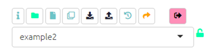
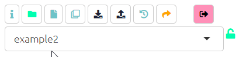
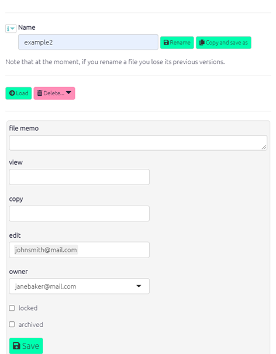
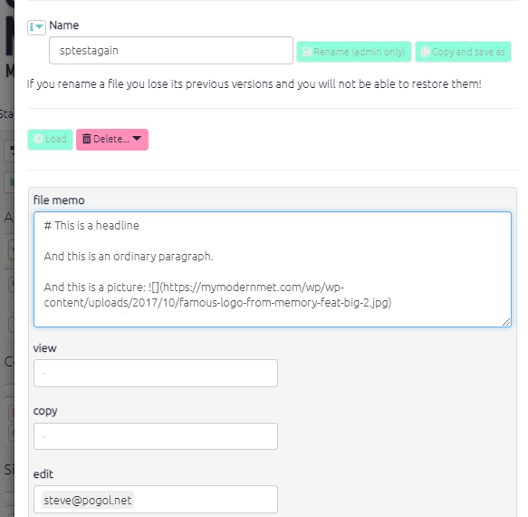
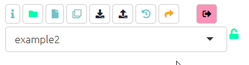
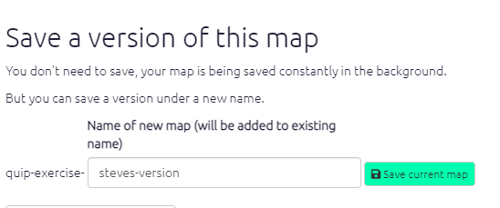
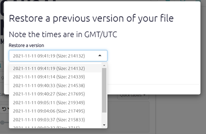
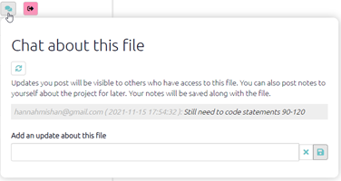
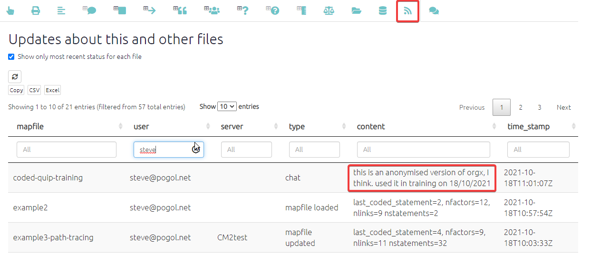
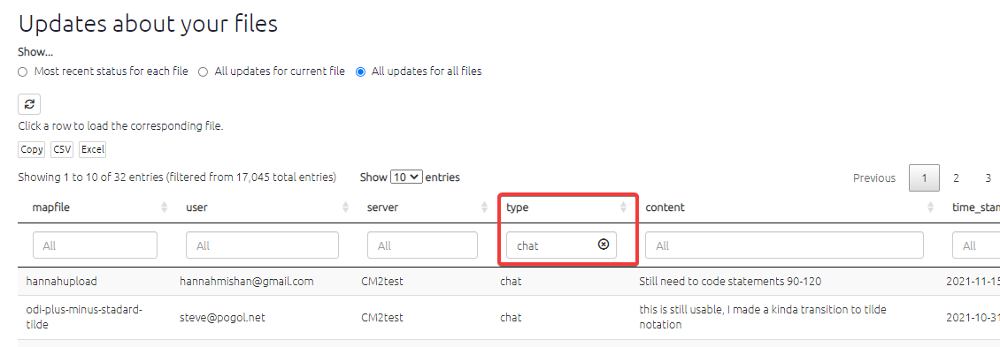

#  The top menu{#xtop-menu}

This section is all about how to manage using the top menu to help you deal with the currently loaded file. Hover over the icons to see what they do.

{width=650}

There is also a dedicated [File Manager](#file-manager) to manage all your files.

## Current File Manager{#xpermissions}

Click the green File icon to manage your file.

{width=650}

{width=650}

### Sharing and locking files

You can add any number of other Causal Map accounts into the "copy" and/or "view" boxes. 

- "Copy" permission means that the other user can make their own copy of this file, which they can then edit.

- "View" permission means that the other user can make only view the file.

You can also use this switch to lock the file. This means that no-one can change it, not even you, until it is unlocked again.

It is also possible to create larger groups of users. Ask us for help with this: hello@causalmap.app. 

### File memo

You can put information about your file in the `file memo` box, and it will be shown below the interactive map to tell other users what this file is about. You can use markdown to format the text, e.g. start a line with # to make level-1 heading. You can even include images using markdown.



This is in addition to any "newsflash" information about updates which you add using the chat widget.


## ⚡ Making your own copy of a file{#xown-copy}


```{r,echo=F}
knitr::include_url("https://player.vimeo.com/video/641927229")
```
Copying a file in Causal Map is easily done. Simply load the file you want to copy using the dropdown menu. Then click the 'Save As' button on the top left of your screen. 

{width=650}

You can then append something to the end of the filename to make it yours:

{width=650}

Click the 'Save current map' button. This window will then close and your copy of the file will load up. You can now make changes to the file. 

## Restoring a previous version of your file

The app is continously saving your work and so you can restore your file to any prevision version, by clicking this icon . This will open the below panel where you can choose which timepoint you wish to revert your map to. 

{width=650}

This panel shows a dropdown list of times when you made changes to the mapfile in GMT. Along with the size of your file which can help you identify which timepoint you want to revert to. It can be easy to forget what time you made alterations to your file, so if you're likely to want to restore a previous map it is best to note the time so that you can easily return to it.


## Uploading your data

{width=650}

The above buttons relate to uploading your data, see [this section](#ximport) for more information.

## Chat about this file

By clicking on the icon of two speech bubbles, a panel containing chat about the file will appear. You can see the comments you and other people with access to this file have added. From here you can also add updates on this file, this function is useful when working collaboratively.




> Why did I make this version of that file? Is it different from version xzy? Did we already import those new statements into this version??

This panel can help with these kinds of problems. You and your colleagues -- anyone else with access to the current file -- can type notes and updates about the file. These updates will be listed here sequentially. 

Also, these same notes and updates are listed in the main Updates panel, along with automatic updates about when files were opened and edited.



So you can use the filters just to search for manual and automatic updates about particular files, or on particular dates; or you can just search for type=chat to view recent chat about any files or some particular files:


