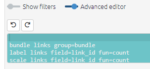
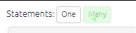
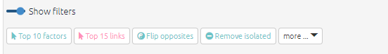

# ⭐ Quick tour of the app

## The left-hand side

### Getting data into the app

- Upload a map in the form of an Excel file (.xls or .xlsx).
- in the file chooser, select any files to which you have access, which include an anonymised dataset from a [QuIP](http://bathsdr.org/) study
- follow a direct link sent to you by someone else to view a file with pre-defined filters applied and which you can then explore for yourself.
- view maps created in the [legacy version of Causal Map](http://causalmap.app/).

### Commands and buttons to apply filters to your map

The left-hand side of the app really only contains the text in the Advanced Editor (which you can view if you want, but close the window if it scares you).

The text window uses a simple syntax for filtering and manipulating the maps and tables.

Nearly all the other buttons on the left-hand side are just ways to manipulate this text. Each line in this window is a filter which manipulates the existing map in some way. The lines in the windows are applied successively to the original map to produce the final map which is then displayed.

### Do some coding (view one statement) or do some analysis (view many statements)?

These buttons add the correct filters to either view just one statement or many statements. 

When you are coding, you will want to view just one statement, and when you want to explore and analyse the entire causal map or sections of it, you will want to view many statements. 

(Even when you are viewing one statement, it is still possible to apply filters for example if the map associated with this one statement is quite large.)

### Top row

Most people like to hide these filters when they are coding, so they hide the filters using the toggle.

But for analysing your map, you will want to open the filters panel.

#### Shortcut buttons

These buttons offer quick ways to add filters without going through a dialog panel.

### The filter buttons

are in three sections: analysis, conditional formats and simple formats. See the section on [filters](https://guide.causalmap.app/all-the-filters.html).

## The right hand side

{width=650px}

### Interactive View

An interactive version of the map in which the elements can be moved around and also the upstream and downstream factors are highlighted when the user mouses over them.

- Drag the factors around
- Copy a map as an image by right-clicking on it.
- Save a PNG image by pressing the button at bottom right.
- Hover over factors to highlight the connected links and factors.
- Hover over factors to display basic information about them and delete them from the entire map.
- Hover over links to see the associated quote and other information.
- Click on links to edit or delete them them.

### Print View

A print-quality version of the map with advanced layout.

### Factor editor

This is the same as the old Multi-edit Panel

### Tables

Several tables showing lists of factors, links and various metrics and which can be filtered and reorganised in marvellous ways. See the section on [tables](https://guide.causalmap.app/all-the-tables.html).
