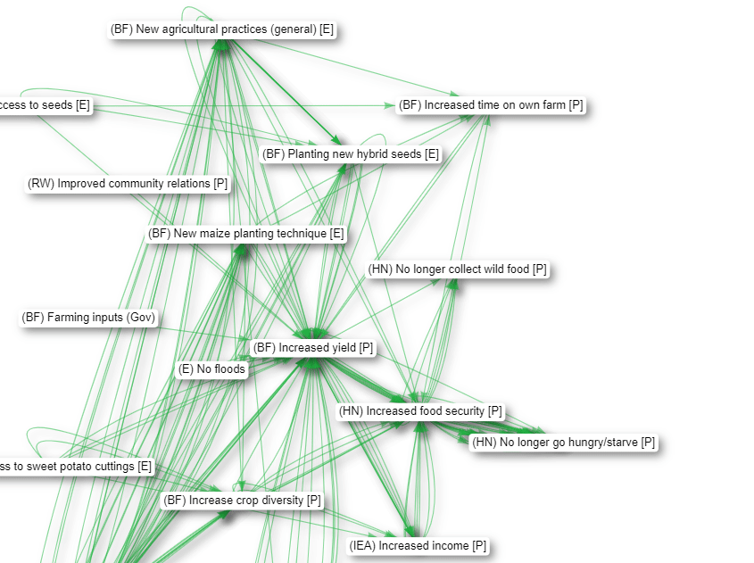
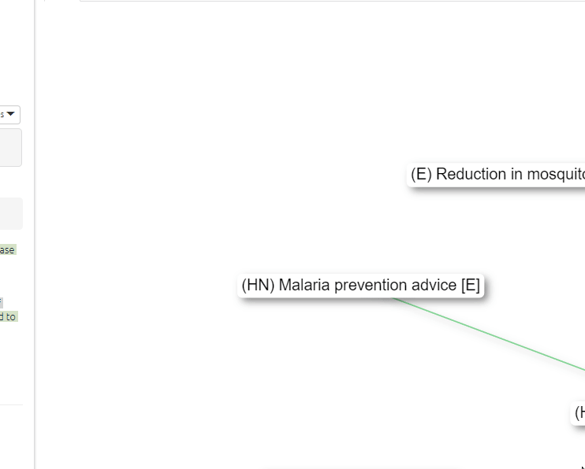
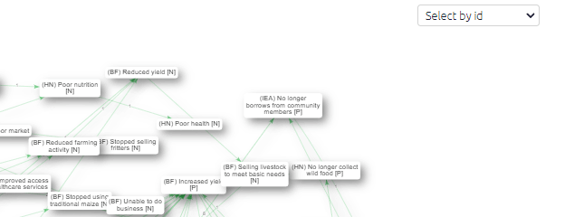
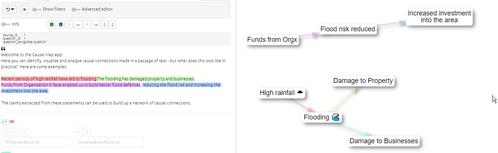

# ⚡ Interactive View{#interactive-view}

An interactive version of the map in which the elements can be moved around and also the upstream and downstream factors are highlighted when the user hovers over them.

- Drag the factors around.
- Copy a map as an image by right-clicking on it.
- Save a PNG image by pressing the button at bottom right.
- Hover over factors to highlight the connected links and factors.
- Hover over factors to display basic information about them and delete them from the entire map.
- Hover over links to see the associated quote and other information.
- Click on links to edit or delete them them.
- Click on factors to focus on them, trace paths from/to them, edit their memo, or delete them.

{width=650}

- Click on factors to edit the label or memo

{width=650}

In both Interactive and Print view, if the factor labels have not been wrapped to any specific width, they are automatically wrapped to 22 characters.

When you have  a lot of factors in your map, the selector in the top-right corner of the map can help locate them.

{width=650}

When you are viewing a single statement, the colour of the links corresponds to the colour of the highlighted sections of text.

Tracing paths to a particular factor directly from the interactive map

