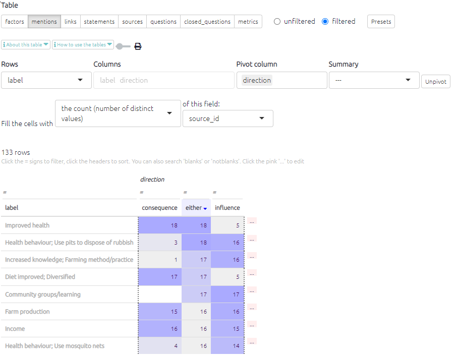

# 🧪The Mentions Table{#xthe-mentions-table}

This table is useful when looking at how many times factors have been mentioned in links. In the Factors table, you can display how many links are coming in and out of each factor overall, but you can't for example ask how many different *sources* mentioned it, or in how many different districts.

It is likely that you will want to view this table using the preset `Mentions (basic)` which can be found in the dashboard.

{width=650}

The Direction field shows you the number of times each factors was reported as an influence factor and/or a consequence factor.

- **Influence**= how many times the factor lead to another factor.
- **Consequence** = how many times the factor was mentnioned as a result of another factor.
-  **Either** = how many times the factor was mentioned in direction.

Remember, in each case these counts depend on what you put in the Count box. You can count link_id (which gives us the overall count, the highest number) or statement_id, source_id, district etc (which usually give a lower number).

As usual you can change what is counted by selecting a different field in the `Count` box. You can also change what is displayed by deleting or adding columns and rows.

This table is merely an overview which can help us to understand which factors are reported most frequently, and whether specific factors were more often cited as an influence or a consequence. To fully understand what the factors mean, they need to be seen in the context of the causal stories they appear in. This table can be useful for initial communication about which factor labels have been created and how often they have been applied, but do exercise caution when presenting this data as it only shows the factor in isolation, whereas when doing causal mapping we are most interested in the relationships between factors.
