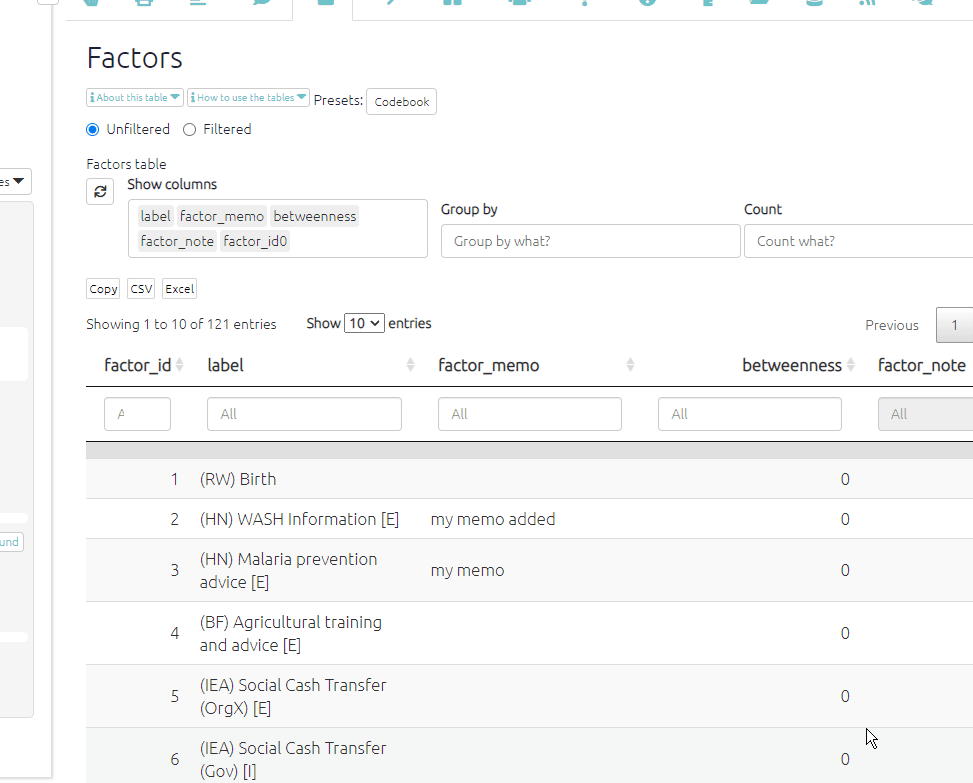
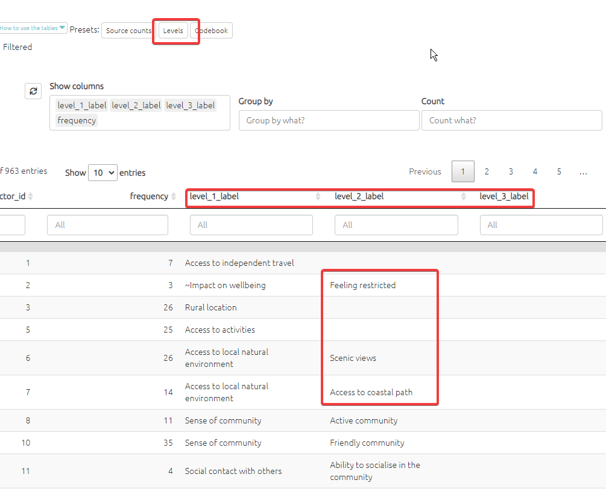

# The Factors table{#xthe-factors-table}

The factors table presents the factors applied during coding. There are columns for label, factor memo, and columns for any other fields you have provided, maybe "domain" for instance. The app also calculates some additional fields like:

- `betweenness` (how central is the factor in the map?)
- `in_degree` (how many links come in to this factor?)

This table is an overview which can help us to understand which factors are reported most frequently, and to view and understand metadata like memos. As usual, this table responds to any filters you have applied on the left-hand side and can be additionally sorted and filtered.

## Factor memos{#xfactormemos}

Factor memos are an important part of your Codebook. They appear:

- when you hover in interactive view 
- in the sidebar in the factor editor 
- in the factors table.

You can create and edit the memos from interactive view:

{width=650}

... or from the factors table:

{width=650}

The factors table has some presets. For example, sometimes it can be useful to break down hierarchical labels into first, second, third levels and so on.

