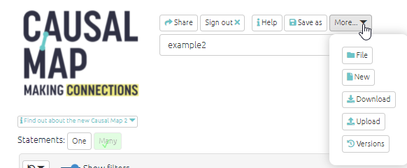
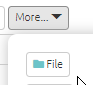
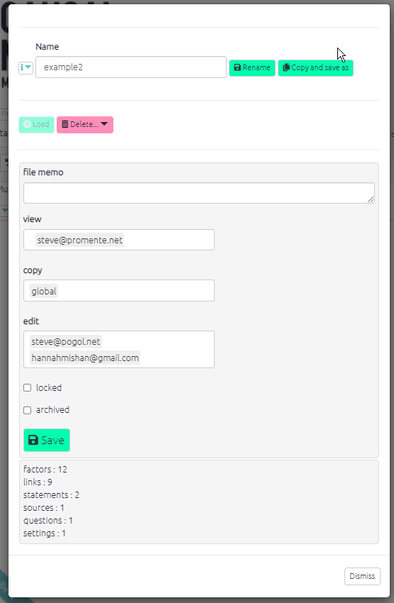

# ⚡ 💻 Managing your file with the top menu{#top-menu}

This section is all about how to manage the currently loaded file.

There is also a [File Manager](#file-manager) to manage all your files.

## Current File Manager

### ⚡ Making your own copy of a file

Copying a file in Causal Map is easily done. Simply load the file you want to copy using the dropdown menu. Then click the 'file' button on the top left of your screen. You will then see the screen shown below with the details of your file.

Change the name of the file and click the 'copy and save as' button on the top right. This window will then close and you will be able to find the copy of your file in the dropdown list. Remember permissions are copied from file to file, so the same people can view and edit your copied map as the original.

### Sharing and locking files

You can add any number of other Causal Map accounts into the "copy" and/or "view" boxes. 

- "Copy" permission means that the other user can make their own copy of this file, which they can then edit.

- "View" permission means that the other user can make only view the file.

You can also use this switch to lock the file. This means that no-one can change it, not even you, until it is unlocked again.

It is also possible to create larger groups of users. Ask us for help with this: hello@causalmap.app. 

