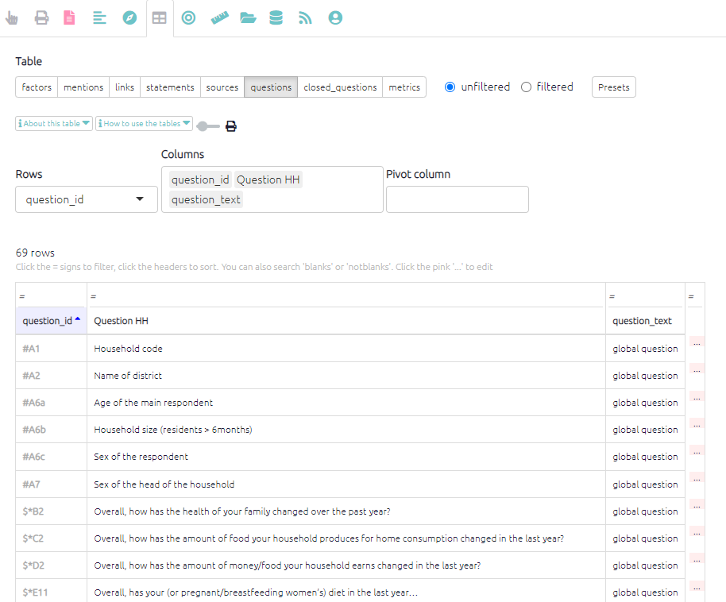

# 🧪The Questions Table{#xthe-questions-table}

This table displays the text, ID, memo and map id for every question included in the questionnaire. 

This table has one preset:

- `All questions (basic)` which displays id and text as shown below

{width=650}

You may wish to include this table as an appendix in your report or as a reference point for looking up particular questions.
