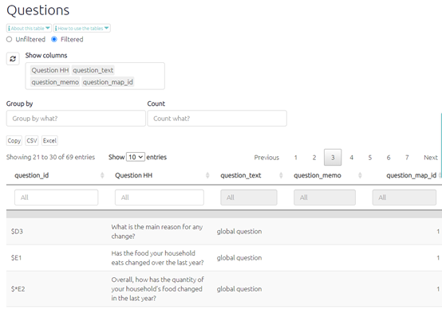

# The Questions Table{#xthe-questions-table}

This table displays the text and ID for every question included in the questionnaire. It may also show any other additional data fields which are the same for each question, e.g. questionnaire subsection or question group.

{width=650}

You may wish to include this table as an appendix in your report or as a reference point for looking up particular questions.
