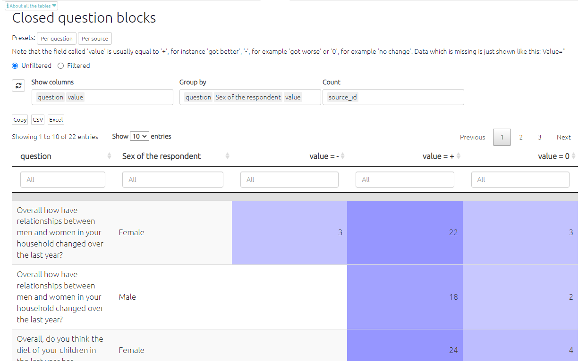

# The Closed Question Blocks Table{#xthe-closed-question-blocks-table}

```{r,echo=F}
knitr::include_url("https://player.vimeo.com/video/596497752")
```

There are two tables which provide a summary of the responses to the **closed questions** asked at the end of each QuIP questionnaire domain. The following symbols are used in the tables to represent the direction of change indicated by the response to the closed question:

| **Symbol** | **Direction  of change** | **Example  responses**          |
| ---------- | ------------------------ | ------------------------------- |
| **0**      | No change                | “No change” “Stayed the same”   |
| **+**      | Positive change          | “Better” “Improved” “Increased” |
| **-**      | Negative change          | “Worse” “Decreased”             |


The closed questions table gives an overview of how each **individual** respondent answered each closed question. The closed question summary table presents the **total respondent counts** for each direction of change. For every closed question you can see how many respondents reported positive, negative, or no change in that domain. You may wish to search and filter the statements to view only the closed question responses from a particular respondent group. 

Why would I use this table?

These tables provide a snapshot of the overall trends of change across the domains, so they can be a helpful introduction and “easing in” to the findings - before diving deeper into the causal stories! The closed question responses can also provide interesting insights when compared to the open-ended responses, especially in cases where they might differ. 

A full list of closed question responses can be found [here](https://guide.causalmap.app/importing-your-data-special-cases.html?q=recodes#quip-recodes-for-closed-questions---live-link).

You can also add other additional data fields like respondent gender:

{width=650}

