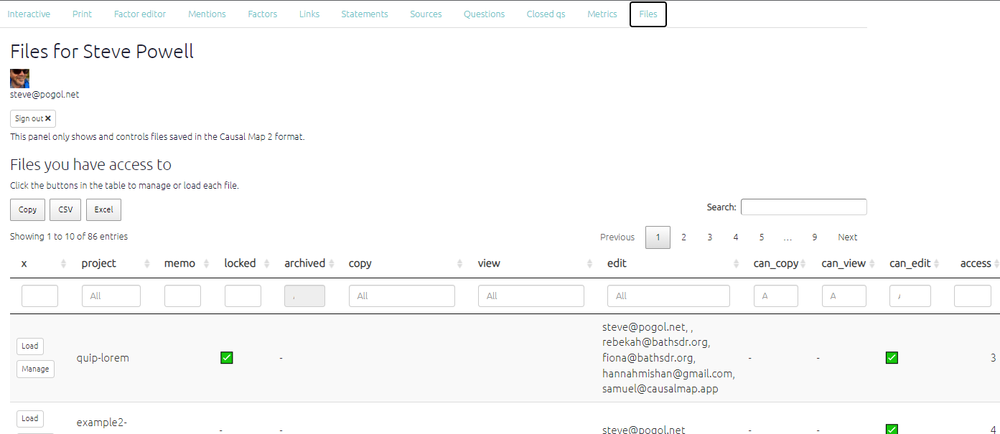

# ⚡ The File Manager{#xfile-manager}

At the top of the page you will find information about your subscriptions, the files you have crested and any teams you manage.

Below, the file manager table allows you to see shows you all the files you have access to and what level of access you have i.e. copy, view or edit access. You can also see details such as whether these files are locked, archived, any memos on the file and what access other users have to these files.

{width=650}

From this page you can either `load` the map or click `manage`to open the [file manager panel](#xpermissions).

