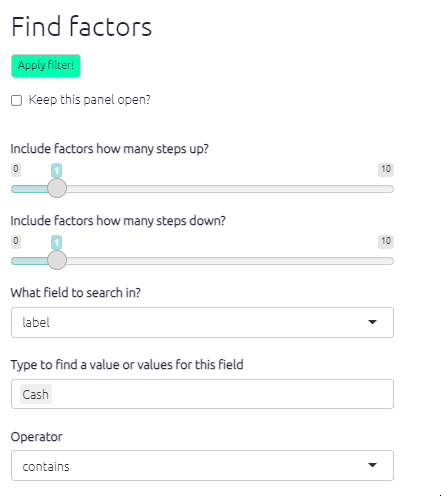
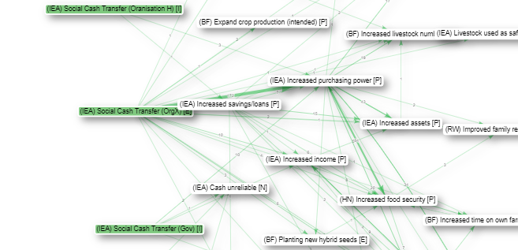

# 💻 All the filters{#filters}

## Intro: Commands and buttons to apply filters to your map

The left-hand side of the app really only contains the text in the Advanced Editor (which you can view if you want, but close the window if it scares you).

The text window uses a simple syntax for filtering and manipulating the maps and tables.

Nearly all the other buttons on the left-hand side are just ways to manipulate this text. Each line in this window is a filter which manipulates the existing map in some way. The lines in the windows are applied successively to the original map to produce the final map which is then displayed.

## Statement Toggle: Do some coding (view one statement) or do some analysis (view many statements)?

This pair of buttons add the correct filters to either view just one statement or many statements. 

When you are coding, you will want to view just one statement, and when you want to explore and analyse the entire causal map or sections of it, you will want to view many statements. 

(Even when you are viewing one statement, it is still possible to apply filters for example if the map associated with this one statement is quite large.)

## Toggles to show and hide filters

Most people like to hide these filters when they are coding, so they hide the filters using the toggle.

But for analysing your map, you will want to open one or the other.

## Shortcut buttons

These buttons offer quick ways to add filters without going through a dialog panel.

## The filter buttons

are in three sections: analysis, conditional formats and simple formats. See the section on [filters](https://guide.causalmap.app/all-the-filters.html).

### Analysis

Top row: Active analysis buttons with explanation. Click to edit, move, delete

Bottom row: All analysis buttons. Click to activate another instance.

These filters apply powerful filters which change the structure of the unfiltered map. Each filter can be applied more than once and they can (to some extent) be moved up and down.

For example suppose you want to show only links from statements in which the word "women" appears in the `text` of the statement. So you apply a `find statements` filter, you click the button with that name. A dialog appears,

you click `Apply filter` and a new button with a human-readable explanation appears in the top row in the left-hand panel. The corresponding button below it gets a green tick to show it is in use, but you can click it again to apply another, different statements filter, for example to find links from all statements in which "women" appears and which were mentioned by *men*:

In this case, you are searching not the `text` of the statement but the `sex` of the source who made this statement.

#### Find factors

#### Searching and filtering factors

To find factors which `contain` the word `Cash` in their `label`, click `find factors` and type to select factors which you want to find.

- Select one or more pre-existing factors. Press `enter` to accept
- And/or just type fragments of text like `Cash` which might match several factors; type a tab to complete

The map changes:

- All factors matched by the search are, by default, *highlighted*.
- Only the factors matched by the search and those upstream and downstream (left and right) of them are shown, as many steps as set by the `Upstream steps` and `Downstream steps` sliders.

Factors are only matched if the search term uses the same case, e.g. “Farming” will not match “farming” or “FARMING”.

For a more visual representation: The following examples demonstrate how applying different upstream and downstream step filters affect the causal pathways presented in the map.

**Searching for text ‘Cash’** 

One step upstream – zero steps downstream

One step upstream – two steps downstream

**Why would I use this filter?** This analysis function is particularly useful for searching for important factors such as intervention activities or intended programme outcomes. This filter is best applied once you know which factors are of importance or interest.

#### Find statements, find links

These filters enable you to filter the causal map to factor in additional data or respondent/source characteristics.

How do I use this filter?

Select an additional data field from the dropdown menu Find Statements. The options available will vary depend on the data you have collected, a typical additional data field might be respondent ID, age, or sex, for example.

Once you’ve selected your field, then type/select the specific criteria you want to filter by (i.e. individual respondent, age category, male/female) into the Filter by… search box. Use the arrows to the right of the search box to toggle between the different options. You can add more than one value (e.g. several age groups or several respondents).

#### Filtering statements

- The second box is prepopulated with all the values for that field, for example education levels. You can select one or more values (e.g. several age groups or several respondents).
- **TIP**: As well as selecting pre-existing values for your search, you can also just type fragments of text which might match several values. So for example, if you are searching question numbers, and you have the questions e1, e3 and e5, instead of selecting all of them you can just type “e”: all the values where this text appears are included in the filter. But be careful that this does not match other values which you did not intend.
- **TIP**: You can use multiple filters all at the same time.

#### Remove brackets

This filter hides any tags or other words written between different kinds of brackets. So instead of this:

you see this:

#### Trace paths / trace robustness

**Why would I use this filter?**

This analysis function is a powerful tool which enables you to view full causal pathways and to interrogate the relationships between specific causal factors.

Using our OrgX example, there is a clear causal path from the ‘Social Cash Transfer’ to ‘Increased Purchasing Power.’ The complexities of this causal path are best seen and shown by using path tracing, as it simplifies the map and highlights the intervening factors between the two factors.

Also, path tracing is the prerequisite for calculating Robustness.

A path length of 1 will only show the one step in the causal chain from/to your chosen factor, i.e. A ➜ B. A path length of 2 will also show the next step in the causal chain (if there is one!), i.e. A ➜ B ➜ C.

#### Bundle factors

#### Combine opposites

## Conditional formats

Conditional formats calculate and visualise information in your map.

The buttons in this section apply conditional formats to the map after it has (optionally) been transformed in the analysis section. Each filter can only be applied once, so when you click an inactive button in the bottom row it becomes active and moves to the top row, and when you delete it from the top row it appears again in the bottom row.

### **Colours**

- if the field is numerical, the values of that field will be assigned to a colour gradient with the given low, medium and high colours. If you specify white or grey as the low point, the mid point will be ignored.
- otherwise, if the field is not numerical, the values of that field will be assigned random colours up to a maximum of eight.

## Simple formats

There is a filter for “cluster factors” which groups your factors into arbitrary groups.

So if you type Intervention, Firms and Impact, three boxes appear just grouping together factors which begin with those phrases, and the factors are regrouped to fit into the boxes.

The setting “layout” makes a huge difference. Usually you will want “dot” layout which lays out your map in a left-to-right direction.

However, other layouts can be useful, for example when you are looking just at the ego network for a single factor, i.e. just the factors immediately adjacent to it, searching just for that one factor and one step up or down, the “circo” layout can be very helpful:

