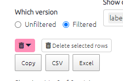
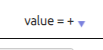

# 💻 All the tables

From simply creating a table showing the total links to and from each factor to a visual representation of each respondent's response to a closed question. The possibilities are large - and increase with the amount of additional data your project has.

## Features common to all the tables{#tables_common}

Numerical tables are presented as *heatmap tables*. The higher the number, the darker the colour of the cell will be.

### Presets{#preset-tables}

If you want to keep things simple, try creating a table using one of the quick presets:

... and the presets relevant to each table are also accessible from within that table:

----

### Main controls

Each table has a set of controls, which are almost the same across all the tables.

When the `Which version` toggle is set as "Filtered", the tables respond to any filters you have applied in the left-hand panel of the app, just as the interactive maps do. The table shows data corresponding to the map as it is currently displayed.

If you want to see all the data in one table for the unfiltered map, switch this toggle to Unfiltered.

- You can copy the data from the tables by clicking Copy table to csv or Excel. You can then paste the data in Word or Excel to create your own tables, graphs, or visualisations. You could also screenshot the table if you prefer!

### Adding columns, grouping, counting

You can also group the rows in the factor tables to show how the data presented differs between various respondent characteristics such as age, education, and sex. Simply select the desired filter from the Group rows filter.

When you put a field in the `count` box, your table will get an extra final column called `total`:

{width=650px}

### Search

You can search / filter the whole table using the box at top-right. And you can search  / filter individual columns using the individual boxes.  (These boxes are greyed out if all the values in the field are the same so there is nothing to search.)

{width=650px}

You can search a column of numbers by using the slider, or by typing an equivalent range:

... so if you type "15...15" you will search just for the number 15:

### Sorting

You can sort the whole table by any column by clicking on the appropriate header:

