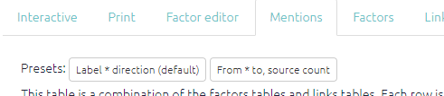

# All the tables

From simply creating a table showing the total links to and from each factor to a visual representation of each respondent's response to a closed question. The possibilities are large - and increase with the amount of additional data your project has.

## Features common to all the tables

Numerical tables are presented as *heatmap tables*. The higher the number, the darker the colour of the cell will be.

### Presets

If you want to keep things simple, try creating a table using one of the quick presets:

... and the filters relevant to each table are also accessible from within that table:

----

### Main controls

Each table has a set of controls, which are almost the same across all the tables.

When the `Which version` toggle is set as "Filtered", the tables respond to any filters you have applied in the left-hand panel of the app, just as the interactive maps do. The table shows data corresponding to the map as it is currently displayed.

If you want to see all the data in one table for the unfiltered map, switch this toggle to Unfiltered.

- You can copy the data from the tables by clicking Copy table to csv or Excel. You can then paste the data in Word or Excel to create your own tables, graphs, or visualisations. You could also screenshot the table if you prefer!

### Adding columns, grouping, counting

You can also group the rows in the factor tables to show how the data presented differs between various respondent characteristics such as age, education, and sex. Simply select the desired filter from the Group rows filter.

When you put a field in the `count` box, your table will get an extra final column called `total`:

### Search

You can search / filter the whole table using the box at top-right. And you can search  / filter individual columns using the individual boxes.  (These boxes are greyed out if all the values in the field are the same so there is nothing to search.)

You can search a column of numbers by using the slider, or by typing an equivalent range:

... so if you type "15...15" you will search just for the number 15:

### Sorting

You can sort the whole table by any column by clicking on the appropriate header:

## The individual tables

### Factors

### Mentions

What does this table show me?

The factors table presents the factors applied during coding (and which are relevant for the current filters) and the number of times they were reported as an influence factor and/or a consequence factor.

- From = how many times the factor was applied as an **influence** factor, i.e. leading to another factor.
- To = how many times the factor was applied as a **consequence** factor, i.e. as a result of another factor.
- The factors are listed with the most frequent first.

Why would I use this table?

This table is merely an overview which can help us to understand which factors are reported most frequently, and whether specific factors were more often cited as an influence or a consequence. To fully understand what the factors mean, they need to be seen in the context of the causal stories they appear in. This table can be useful for initial communication with the commissioner about which factor labels have been created and how often they have been applied, but do exercise caution when presenting this data as it only shows the factor in isolation, whereas QuIP is most interested in the relationships between factors.

### Links

### Statements

### Sources

What does this table show me?

The sample table [without any filters applied] simply lists all of the respondents and any additional data collected about them (sex, age, location, education.) It also shows the interview type (individual or focus group) for each source. When filters are applied, the table will only present the relevant sources/respondents. If you are searching and filtering for a specific factor, this table will update and only show sources who reported that factor.

Why would I use this table?

In the first instance, this table can be useful to check that all the sources have been imported into the app correctly. The table also provides a summary of the respondents which can be useful for presenting respondent demographics in the report, either in the sampling section or as an appendix.## Questions

### Questions

What does this table show me?

This table displays the text and ID for every question included in the questionnaire. It may also show any other additional data fields which are the same for each question, e.g. questionnaire subsection or question group.

Why would I use this table?

You may wish to include this table as an appendix in your report or as a reference point for looking up particular questions.

### Closed question blocks

There are two tables which provide a summary of the responses to the **closed questions** asked at the end of each QuIP questionnaire domain. The following symbols are used in the tables to represent the direction of change indicated by the response to the closed question:

| **Symbol** | **Direction  of change** | **Example  responses**          |
| ---------- | ------------------------ | ------------------------------- |
| **0**      | No change                | “No change” “Stayed the same”   |
| **+**      | Positive change          | “Better” “Improved” “Increased” |
| **-**      | Negative change          | “Worse” “Decreased”             |

The closed questions table gives an overview of how each **individual** respondent answered each closed question. The closed question summary table presents the **total respondent counts** for each direction of change. For every closed question you can see how many respondents reported positive, negative, or no change in that domain. You may wish to search and filter the statements to view only the closed question responses from a particular respondent group. 

Why would I use this table?

These tables provide a snapshot of the overall trends of change across the domains, so they can be a helpful introduction and “easing in” to the findings - before diving deeper into the causal stories! The closed question responses can also provide interesting insights when compared to the open-ended responses, especially in cases where they might differ. 

A full list of closed question responses can be found [here](https://drive.google.com/drive/folders/1wvifDQ0BXmAjSudTRUv9i_4JURpphD4v)

