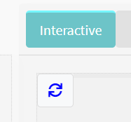
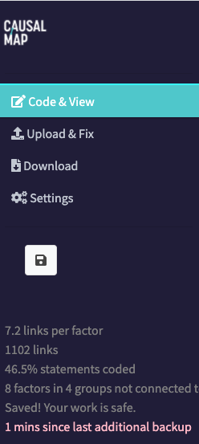

# 💻 Getting started with the Causal Map app{.hi #starting}

## Prerequisites for using the app

The app is tested on Chrome, Firefox on Mac and Windows, and Safari on Mac, it should work fine on Chrome, Chromium and Firefox on Linux. 

You need a screen with a large resolution, preferably HD or better. It won’t work well on tablet or phone. You will probably want to zoom out to about 80% (in Chrome, press Ctrl – once or twice) to make sure everything fits on the screen. You may also like to view the app "full screen" – how to do this depends on your browser and operating system; on Chrome on Windows, press F11.

As Causal Map is a web application, you will also need a reasonably reliable internet connection. 

## Features of Causal Map

**See** our [pricing page](https://causalmap.app/pricing/).

* Import data (and meta-data about your sources) in different formats
* Code causal claims in the form A –> B
* Code multiple claims at once
* Add memos and hashtags
* Code additional claims as a continuation of previous claim (“chaining”)
* See a summary of all statements from a specific source
* View additional information about each statement (e.g. question and respondent characteristics)
* Create simple or hierarchical factor labels
* Edit many factors and links at once in a powerful bulk editor
* Filter the global map by: Current statement; Factor label; Link (quote, hashtag, memo etc); Statement (text, additional data e.g. respondent characteristics)
* Simplify the map by “zooming out” or showing only most frequent factors or links
* Trace paths from one set of factors to another
* Show maps which are *distinctive* for a specific group e.g. women
* Use the interactive viewer to edit your map
* View and export print-quality maps
* View all quotes for a specific view, and get a smart summary
* Create detailed tables: Factors; Sample; Questions; Differences; Closed questions
* Calculate **Quantity of Evidence** for causal paths between sets of factors
* Download/export your data in different formats
* Automatic additional backups every 30 minutes and restore from a backup
* Share files with others for viewing or editing
* Code additional properties of links like strength and certainty, or mark pairs of factors which are opposite to one another


## Signing up and logging in

Start your journey at go.causalmap.app. The first time you use the app you will see a screen like this:


 Click the “Sign up” link at the bottom and create a password in the usual way. Use the email address corresponding to your subscription.

Check your email (you may need to check your spam folder): you will receive a verification code which you need to type or copy into the app.

Make sure you have typed your email correctly when requesting a password reset. The email field is **not** case sensitive.

Remember to make a note of your password, or let your browser store it for you. You can now log into the app using that password.

You will then see a screen like this:


  


## Choosing files


The files you are able to view, copy or edit are listed in the first box in the file chooser (above), with the ones you viewed most recently listed first. You can just use your mouse to select a file, or, as with all menus like this in Causal Map, you can press your delete key and type to search for files.

In this box you will find at least, depending on your subscription:

·     the file “example-coded”, an anonymised real-life QuIP file which has already been coded. You cannot edit this file, but you can try out different ways to filter and query the causal map. 


·     your own copy of example-coded (or similar), with a name beginning "example-for-you-to-code" with the same narrative data in the form of statements, but with the codings removed. You can edit this file to try your hand at coding.

You can also view other people’s files if they have shared them with you.

From this screen you can also create a new file.


You should then wait for the file to fully load (if it takes longer than a minute, try pressing “Dismiss”).

At any time, you can return to the file chooser, e.g. to switch to a different file, by pressing the File button on the right.


 

## Working collaboratively

If you have more than one login, you can work successively on the same file, but you can’t work on the same file at the same time. 

If Sam opens a file for editing, if it is opened again for editing by same user (Sam) in a different tab or on a different server, or by a different user, then Sam's original version of the file is closed.  This won't result in data loss except minimally if Sam is in the middle of edits e.g. in multi-edit.
Note this only applies to editing the file: there can be multiple viewers but only one editor. 

If Sam uses the app at all with Sam's ID (i.e. email address), if there is any other login with the same ID (by Sam in a different tab or even on a different server, or by someone else), then Sam's original session is closed. This won't result in data loss except minimally if Sam is in the middle of edits e.g. in multi-edit.

These two checks are made every 60 seconds.


## Caveats

The app is still in rapid development – we are adding features continuously. If it freezes, goes very slow or gets disconnected, try refreshing the page.

If you need to refresh the browser cache too, press Ctrl / Cmd shift F5. 

If you the interactive map looks strange, or you can’t “catch hold” of the contents, press the blue Refresh button in the top left of the map.

 

The app saves your *coding work* continuously, you don’t need to press save. But some *other* parts of the app have an “Update” button, remember to press it if you make changes!

Please let us know [hello@causalmap.app](mailto:hello@causalmap.app) if you have any problems. 

## Files

All work at Causal Map is organised into files. A file contains all the data for one piece of work: the text you want to analyse or code, and all the coding you have done.

File names can only be lower-case letters and numbers, and “-“.

## Sharing and access

See the section on the [File button](#sharing).

## Groups

Your user ID (your email address) can be member of one or more groups. 

If you are part of an institutional subscription, or a training group, you will be a member of that group.

The name of your group(s) appears in the drop-downs for selecting other files (see above) as well as the email IDs of the members of the group. You can select the group name(s) and the email IDs of your peers within the group in the access control widget in order to share your file(s) with them. When you share a file with a particular user, they will see the name of that file in the file-chooser drop-down menu.

Groups can also be used to auto-clone group-specific files which are available to all the members of your group, for example for training purposes.

## Guests

If you have an institutional subscription, you may have been given additional guest IDs like guest+1@causalmap.app which are always read-only accounts just for viewing (but not editing) your files. You can give these account details to others, for example a supervisor or commissioner, so that they can view your files. As elsewhere in the app, if one person is logged in with a particular email ID, and then someone else logs in to the app with it, the first person will be logged out. 


## 💻 Overview of the app: The tabs

 

The app consists of several tabs, you can switch between them by clicking on the tabs in the sidebar on the left. The sidebar expands when you hover over it. 




## 💻 Overview of the app: The Code & View tab

You will spend nearly all of your time in the Code & View tab, which is described in this section. The other tabs are described later [See here](#restoftheapp)

### 💻 The navigation bar (at the top)

The file chooser menu on the right shows you all the files you can edit or view. 

- The orange "copy" symbol, <i class="fa fa-copy"></i> to the right of the file chooser, means that you can make a copy of the current file but not edit it.


### 💻 The left-hand panels

You can resize the left-hand panels in relation to the right-hand panels by dragging the right-hand edge of the left panel to the left or right. This edge has a dotted grey line to make it easier to find.

#### Filters

There are various **filters** which can be applied to the maps, quotes, and tables to analyse the data. 

More information on the individual filters can be found later on in this Guide.

   Firstly, if you want to view the dataset as a whole, make sure View statements one by one filter is off by clicking on the toggle (it should turn from green to grey). 


 The Show filters panel should then automatically open. If it doesn’t, click on the toggle (it should turn from grey to green).

 

- You can open and close each filter shown in the filter panel by using the toggles. 

- When you select and apply a filter, the visualisations, quotes, and tables on the right will update. 

- You can apply multiple filters at once. 

- The filter bar will be highlighted in pink if you have applied any filters – always be aware of which filters you have applied and remember to be transparent about these in your reporting. 

```{r,echo=F,class="show_mark"}
show_mark("Interface/show-filters.md" )

```


#### Multi-edit

In the multi-edit pane, you can edit factor names and merge factors, but you cannot delete factors. (This makes sense: if you had factors b c d and you deleted b, it wouldn't know do you really want to delete b or maybe rename b to c, c to d, and delete d.)

```{r,echo=F}
show_mark("Interface/leftcard-Editfactorlabels-tab.md")
```


#### Viewing your statements


```{r,echo=F}
show_mark("Interface/show-statement-pager-combo.md")
```

### 💻 The right-hand panels

There are four main panels which present and visualise the data. More information on each can be found later on in this Guide.

#### Interactive

The interactive map displayed during coding and updates automatically as you code the factors and links for each statement. This interactive causal map displays all the causal links between factors which correspond with your search/filter criteria. You can drag factors around using your mouse to rearrange the map. You can also view the quotes associated any of the causal links by hovering over the arrow that connects the two factors. [See the section 'Viewing the interactive map' for more detail](#viewing-the-interactive-map).

#### Print

Here you’ll find a high-quality static map which is particularly useful for including in reports as it presents the causal stories clearly. See section [See the section 'Viewing the print map' for more detail](#viewing-the-print-map)

#### Quotes

Here you will see a list of all the quotes which correspond to the filters you have applied. This is useful for selecting and copying quotes related to particular stories of change, to include in the report. At the top of the Quotes tab, the most 'typical' sentences of the quotes will be displayed - these should provide a nice summary of the quotes as a whole.

#### Quantity of Evidence (QE)

If you have selected factors in both the “Source Factor” and “Target Factor” filters, the app traces all the paths from the Source factor(s) to the Target factor(s). This panel then calculates for you the *robustness of the argument* that the source factor(s) influence the target factor(s). [See the section 'Quantifying causal evidence' for more detail](#quantifying-causal-evidence)

#### Tables

Here you will find a selection of tables giving information about the factors and links in the current view, and other data associated with them, such as characteristics of the corresponding sample of respondents. [See the section 'Tables in the app' for more detail](#tables-in-the-app)