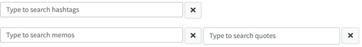
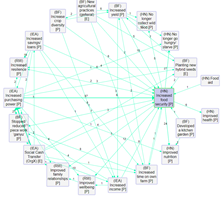
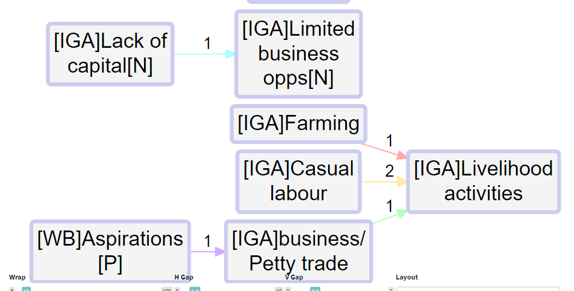
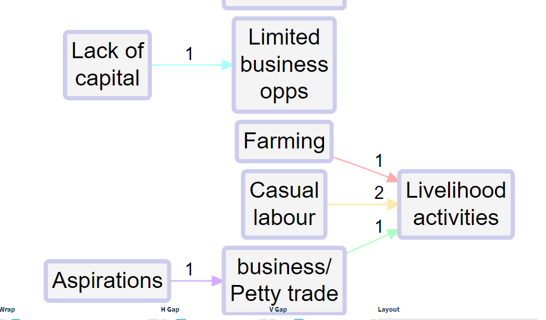

# Analysis: viewing and filtering the map{#analysis}

Various kinds of software are available to simplify the task of viewing and filtering a causal map, especially for larger maps. For example, gephi.org is a good choice for very rapidly manipulating even very large maps - much larger than Causal Map can handle.

A causal map can be filtered to show only some parts of it. Some submaps are well-known from network analysis, for example the “ego network” for a particular factor is the part of the map which includes only those factors directly connected to it. This is something like searching for that particular factor. 

An related approach is to specify one set of Source factors and another set of Target factors and to display only the links along paths which lead from a Source factor to a Target factor. This is called an “etiograph” in a seminal organisational analysis of Utrecht Jazz Orchestra (Bougon, Weick, & Binkhorst, 1977). 

## 💻 Viewing the interactive map

 

```{r,echo=F}
show_mark("Interface/rightcard-Interactive-tab.md")
```


## 💻 Filtering the map: factors


```{r,echo=F}
show_mark("Interface/show-factor-search-combo.md")
```

**Why would I use this filter?**
This analysis function is particularly useful for searching for important factors such as intervention activities or intended programme outcomes. This filter is best applied once you know which factors are of importance or interest.


## 💻 Filtering the map by link, hashtag, memo...

This filter enables you to search for causal links with certain hashtags, memos or quotes. 


How do I use this filter? 

As with the previous search boxes, simply type/select the hashtag, memo, or quote you want to focus on.



Why would I use this filter? 

Use it to find words or phrases in specific quotes which you have highlighted while coding. And if you’ve added hashtags or memos to causal links during coding, this filter allows you to search for them in the causal map. 

## 💻 Filtering the map by statement, source, question...

 

This filter enables you to filter the causal map to factor in additional data or respondent/source characteristics. 

How do I use this filter? 

Select an additional data field from the dropdown menu Filter statements. The options available will vary depend on the data you have collected, a typical additional data field might be respondent ID, age, or sex, for example. 

Once you’ve selected your field, then type/select the specific criteria you want to filter by (i.e. individual respondent, age category, male/female) into the Filter by… search box. Use the arrows to the right of the search box to toggle between the different options. You can add more than one value (e.g. several age groups or several respondents).

 

```{r,echo=F}
show_mark("Interface/show-statement-search-combo.md")
```

Check the checkbox to the right of the arrows and ‘X’ button if you want to view a map which shows links which are **unique** to your search criteria. For example, by checking the box above, the map would then show causal links that *only* respondent mjf-1 reported – if indeed there are any links that are unique to them, or almost unique to them (they mention them much more often than anyone else). [See later section](#comparing).

 

Why would I use this filter?

This filter is especially useful for understanding the differences between respondents and for selecting case studies to report on. 

Using this feature, you can view a causal map from the female respondents and then compare it to the causal map from the male respondents. You can even view the causal map from a single respondent, which you might choose to present as a case study. 

 

 

## 💻 Viewing the Print map

In Print view, there is a checkbox for "clusters" which groups your factors into strict top-level groups. It is only useful if you are nesting, and sometimes annoying. but now you can use the search box next to it to type (the beginnings of) any boxes you want to make. 

So if you type Intervention, Firms and Impact, three boxes appear just grouping together factors which begin with those phrases, and the factors are regrouped to fit into the boxes.

The setting “layout” makes a huge difference. Usually you will want “dot” layout which lays out your map in a left-to-right direction. 

 

However, other layouts can be useful, for example when you are looking just at the ego network for a single factor, i.e. just the factors immediately adjacent to it, searching just for that one factor and one step up or down, the “circo” layout can be very helpful:

 

This checkbox  hides any tags or other words written between square brackets. So instead of this:



you see this:




