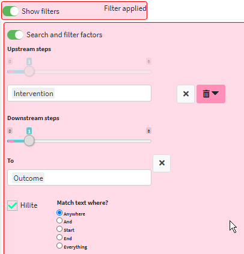

# Analysis: path tracing{#tracing}

## 💻 Tracing paths in the app

We already saw how we can use the factor search box to filter the map, and mentioned that we can also search using the “Target” box. When we put text to search for factors in both the boxes, we call this “path tracing”. 

Choose your desired **path length** by selecting a number from the Downstream steps slider.

 

A path length of 1 will only show the one step in the causal chain from/to your chosen factor, i.e. A ➜ B. A path length of 2 will also show the next step in the causal chain (if there is one!), i.e. A ➜ B ➜ C. The maximum path length/number of steps is 8, however, most causal chains are typically shorter than this. 

Why would I use this filter?

This analysis function is a powerful tool which enables you to view full causal pathways and to interrogate the relationships between specific causal factors.

Using our OrgX example, there is a clear causal path from the ‘Social Cash Transfer’ to ‘Increased Purchasing Power’. The complexities of this causal path are best seen and shown by using path tracing, as it simplifies the map and highlights the intervening factors between the two factors. 

Also, path tracing is the prerequisite for calculating the “Quantity of Evidence”, [see later](#quantifying-causal-evidence).

