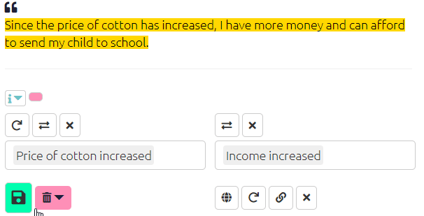
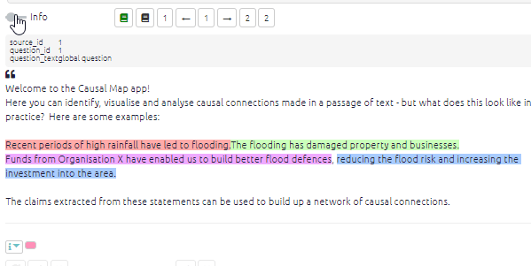

# More coding

if you are using hierarchical coding, top-level components will appear to be selected even if you have not used them explicitly so far. For example, if you have used the factors `health; mental` and `health; physical`, the factor `health` will appear even if you never used it explicitly. You can then easily create new nested factors such as `health; spiritual`by selecting `health` and then typing `; spiritual` with a leading ";". The app will automatically join these for you into the factor `health; spiritual`. 

- once you have selected an influence factor, the order of the choices available for the consequence factor will be silently updated, presenting at the top of the list the most frequently mentioned consequences of the influence factor you have chosen.

### Creating more than one link at a time

This video shows how to create more than one causal link at a time.

```{r,echo=F}
knitr::include_url("https://player.vimeo.com/video/588851236")
```

### 

##  Chaining Links{#xchaining-links}

```{r,echo=F}
knitr::include_url("https://player.vimeo.com/video/588881701")
```

Chaining links is easily done and useful when you have statement where one consequence leads to another, which leads to a third, and so on. To use this function simply click the chain icon below the consequence factor box and the app will automatically fill the influence box with the consequence from your previous link.

{width=650}


 

## Using memos and hashtags{#xmemosandhashtags}

### Memos{#xlink-memos}

Qualitative coding usually involves making notes and memos, and you can do this in Causal Map too.

This toggle opens both additional statement info, i.e. info for any fields which start with #, for example you might have a field #gender in your statements table, and also shows the boxes to edit the memos. (In this example, there is no additional information.)




### Hashtags / link flags{#xhashtags}

Hashtags are available as a special kind of memo when coding a link: you can use them to provide any kind of additional information, for example:

- about **the causal connection**, e.g.
  - the respondent says this is only true for their village, not for other villages
  - where a link is only projected for the future
- about **the claim about the causal connection**
  - where a link is only a hypothesis
  - to add other qualifying information like “source seems unsure.”
  - respondent doesn’t like this connection 
  - respondent feels good about the outcome.

- for you, the analyst, e.g.
  - respondent is answering a different question 
  - to tag links you want to come back and review. 


As usual in Causal Map, you can apply one or more hashtags, and you can either select existing hashtags or create new ones on the fly.

Later, you can [filter the map](https://guide.causalmap.app/analysis.html#filtering-the-map-by-link-hashtag-memo) to show only links containing specific hashtags (or parts of hashtags), and also for links which do *not* contain specific hashtags or parts of hashtags.

