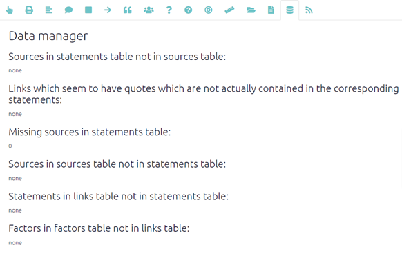

# Data manager {#xdata-manager}

This page gives you useful information about your mapfile. Ideally you want the page to look like the screenshot below, with all information in the relevant table. It is good to check this page to ensure your data is in the correct place, especially after you have [uploaded your data](#ximport).

  {width=650}
