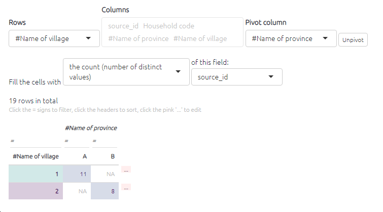

#  🧪Tables - advanced

We already saw basic information about [tables](#xall-tables).

## Features common to all the tables{#tables_common}

### Main controls{#xtables-advanced}

Each table has a set of controls, which are the same across nearly all the tables.

When the table is set to "Filtered", the tables respond to any filters you have applied in the left-hand panel of the app, just as the interactive maps do. The table shows data corresponding to the map as it is currently displayed.

If you want to see all the data in one table for the unfiltered map, switch this toggle to Unfiltered.

### Search

You can search / filter the whole table by clicking on the equals sign at the top of a column. To search numerical volumes you can type in the vaue you are searching for or you can use `>` and `<` to search for values less than or greater than a set number.

{width=650}

### Sorting

You can sort the whole table by any column by clicking on the appropriate header:

## Creating your table

There are three possibilties: 

1. **A normal table**. You simply select the first column you want in the "rows" box and then add any others you need in the "columns" box.

2. **Compressed rows**. This happens when you select a field for your rows which is "shorter" than the actual number of rows in the table. For example [5043](https://causalmap.shinyapps.io/tokyo/?s=5043) , in the factors table you can select level_1_label. Because there are fewer of these than there are factors, the table will be "compressed" and we can choose how we want the multiple results for each row to be displayed -- here we have chosen to display all the labels, but we could also have displayed just the number of values.  

   

Here, we compress the sources table just by the answer to their question on purchasing power [5044](https://causalmap.shinyapps.io/tokyo/?s=5044), and display several other columns. 

This is the same thing, but showing just the counts in each cell: [5045](https://causalmap.shinyapps.io/tokyo/?s=5045).

3. **Pivot tables**. It is possible to construct pivot tables by selecting a column to pivot by: [5046](https://causalmap.shinyapps.io/tokyo/?s=5046). Again, you can fill the cells with all the values of a field you select, like source_id, or all the unique values, or the counts.

Pivot tables give us lots of new possibilities, like this display of closed questions: [5047](https://causalmap.shinyapps.io/tokyo/?s=5047). 

## Print view{#xprint-view-tables}

Do you want some preformatted quotes for your report?

{width=650}

Each table can also be shown as simple text for copying and pasting.

If you want printable quotes for your report, there is a table preset for that. Or go manually to the links table, click the 🖨️ button to display Print View, and choose the columns you want. They will be shown in the Print View in the same order. Then just copy and paste using the "Copy" button.

## Formatting your table{#xformatting-your-table}

Below all tables you will see the below buttons which allow you to format the table as you wish. The columns in table with numerical values can be presented as a heatmap. The higher the number, the darker the colour of the cell will be.

{width=650} 

## Saving your table{#xsaving-your-table}

You can copy the data from the tables into your clipboard by clicking `Copy` , and then you can then paste the data in Word or Excel to create your own tables, graphs, or visualisations.

You can save your table as `CSV` or `Excel`. These buttons will export all the data in the current table.

Alternately, you can save the table as a picture or png if you prefer!

Or you can save a link to this table and share it with a colleague just as you with other [shortlinks](xsharing_view).
