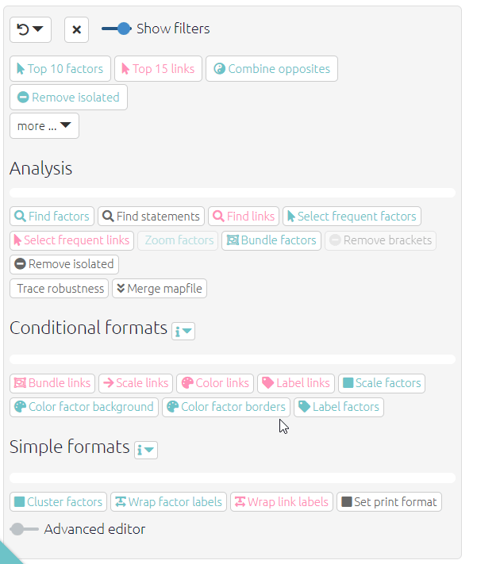

# 📚 Tracing paths and calculating robustness{#xrobustness}

## Summary

### How to trace paths and calculate robustness{#howtotracepathsandrobustness}

Tracing paths allows you to view full causal pathways and to analyse the relationships between specific causal factors. You will find the `trace robustness` filter in the `analysis` filters section.

{width=650}

This will open the `trace robustness` panel which asks you to select how many steps to trace and which factors to trace from and to. Type one or more factors to begin your path (these are the `origin` factors) and which factor or factors you want the path to end at (the `target` factors). If necessary, move the slider to select how many steps down you want the path to go. 

{width=650}

If you want you can also leave either (but not both) factor selectors blank, e.g.

- to search from some specific factor or factors to "anywhere", or 
-  to search from "anywhere" to some specific factor or factors.

If you want to search from or to the **main** drivers and/or outcomes:

- put "main_drivers" in the first box
- and/or put "main_outcomes" in the second box.

"main_drivers" uses an algorithm which identifies 1-3 factors with the highest `driver_score` , i.e. and likewise for outcomes. 

Once you click `apply filter` your map will appear, as below. Orange indicates the origin(s) of the path, purple the target factor(s) and green any factors in between.

{width=650}

 4427

{width=650}

In this example, there are causal paths from the two external factors to the two outcomes. In real-life examples, these paths may be much harder to follow, so their are best seen and shown by using path tracing, as it simplifies the map and highlights the intervening factors between the two factors.

A path length of 1 will only show the one step in the causal chain from/to your chosen factor, i.e. A ➜ B. A path length of 2 will also show the next step in the causal chain (if there is one!), i.e. A ➜ B ➜ C.

Path tracing is the prerequisite for calculating Robustness.

It is [also possible]({#xrobustness-by-field}) to count, for example, how many sources mentioned a complete path.

### 🧪Removing unwanted links

Suppose you have a map with links B --> D, C --> D and also B --> C. If you run this filter:

`trace paths length=1 to=D`

the app will show you also the path from B to C, because both B and C are one link away from D, and there is a path from B to C. But that might have surprised you, as the path from B to C does not get you any closer to D. 

So you might prefer this filter:

`trace paths length=1 to=D remove_links=T`

... which will remove any such links.

In other words, `trace paths length=L from=X to=Y` says "show me all the factors which are on paths from X to Y no longer than L, and all the links between such factors" whereas `trace paths length=L from=X to=Y remove_links=F` says "show me all the paths from X to Y no longer than L". This should probably be the default, but in order to maintain compatibility we will leave it like it is.

### How to calculate robustness

Once you have applied the [trace path filter](#howtotracepathsandrobustness), you can find the robustness calculations in the `robustness` tab. Here is the table for the example above.

{width=650}

{width=650}

In this tab you will find a table displaying the number of links between your `origin` and `target` factors. A larger number means more evidence; more pieces would have to be deleted until we gave up the hypothesis that the Origin factors influence the Target factors at all. 

For example, in the top row of the table above you can see that there is more evidence that rainfall influenced both of the targets compared to the influence of loss of forests. In the first column, you can see that there is more evidence of the influence of external factors on people moving away than on people getting angry.

The [following section](#howtoanalyseobustness) will expand on how to understand these figures.

## Understanding robustness{#analysingrobustness}

Robustness identifies how many pieces of evidence (individual mentions of individual links) would have to be deleted so that there is no longer any path from the Origin factors to the Target factors. It is important to understand a large number does *not* necessarily mean that this path is *strong* in the sense that the Origin factors have a *large* effect on the Target factors. It says there is plenty of evidence for the path, *whatever its strength*.

Subtotals are provided for each Origin factor, when there is more than one, and/or for each Target factor, when there is more than one; it can be useful to compare the amount of evidence for the impact of each Origin factor (and/or Target factor).

These numbers are not very useful on their own. But they are useful for comparisons. 

## Amount of overlap

If you look at the robustness of the path from interventions B and C to an outcome E, one thing you can do is compare the sum of the score for the two sets of paths and compare it with the overall score. If the overall score is more or less the same as the larger of the score for B and the score for C, you can assume that the (evidence for the) intervention paths overlap - so if the score for B is larger, you could say that C uses many of the same paths. But if the overall score is more like the sum of the two, you can deduce that the interventions work more independently. So for example if you are already funding intervention B, and you have to decide whether to fund C or D, and your causal map says that the score from C to E and from D to E are similar, you'd want to look at the pairs - you'd want to look at B plus C to E and compare it with B plus D to E. B + D might have a much larger score than C +D, because C shares many paths with B, but D doesn't. So you'd want to fund D, as the combination of B and D would be more robust.  

Of course, in principle you can see all of this just by looking at the maps and to what extent B, C and D share paths to E. But sometimes it is hard to see and this metric anchors a narrative description in actual numbers.

<!--## Tracing paths and calculating robustness *by field* {#xrobustness-by-field}

### Tracing paths by field, e.g. "by source" 

[this is superseded by [thread tracing](#xtracing-threads)]

Don't fall into the [transitivity trap](#xtransitivity-trap)! 

The trouble with the existing maps is that if you ask for paths from A to C, it might include links from sources which never actually mentioned any complete path from A to C. It might even be that there is no complete path from A to C in the sense that no single source mentioned any such path in its entirety.

By default, path tracing shows all the paths from the origin (set of) factors to the target (set of) factors which can be constructed using information from *different sources*. But sometimes this is not what we want. We only want to see paths which were actually mentioned in their entirety by individual sources. It is easy to construct a single such map from origin to target for a single source. And if we are interested in more than one source, we can combine those maps to construct a shared map for that group of sources. 

By setting the field to `source_id` you only show links which are part of a complete path which at least one individual source mentioned in its entirety. The width of the links can be set to a new metric, namely the number of sources whose complete evidence included that path: who mentioned a complete path which ends at the consequence factor of the link.   So you could for example set the width of the links to this new metric but for comparison set the link label to a familiar metric (e.g. `count: link_id`): the total number of mentions of the link (regardless of which source they are from, i.e. including sources which never mentioned this link as part of a whole path).

Even these maps can still be misleading: you must not assume that any arbitrary path you can trace through the map was actually mentioned by one particular source. You only know that *each of its links* was *part of some path* which was mentioned in its entirety by some source.

### Calculating robustness by field, e.g. "by source"

Just because there is a lot of evidence for all the different parts of a path does not mean that any one source, or type of source, actually mentioned all those parts. 

For this reason, `trace robustness` also lets you ask that question. 

For example you can put `source_id` in the box in order to count how many sources mentioned at least one entire path from the source to the target factor(s).  

This is important because it's usually more credible to ask how many people mentioned all the bits of some path than to ask how many pieces of evidence are there altogether.

Or you could put `District` to find out, looking at each district individually, there is evidence (possibly assembled from different sources within that district) for the path.   -->

