# Conditional formats{#xconditional-formats}

Conditional formats calculate and visualise information in your map.

The buttons in this section apply conditional formats to the map after it has (optionally) been transformed in the analysis section. Each filter can only be applied once, so when you click an inactive button in the bottom row it becomes active and moves to the top row, and when you delete it from the top row it appears again in the bottom row.

## Conditional formatting for links {#xformatting-links}

Conditional formatting gives you more options with links than with factors. It applies to:

- scale links
- colour links
- label links

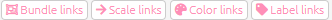{width=650}

When you click one of the buttons, you are asked how you want to colour, scale or label the links - the choices are the same. 


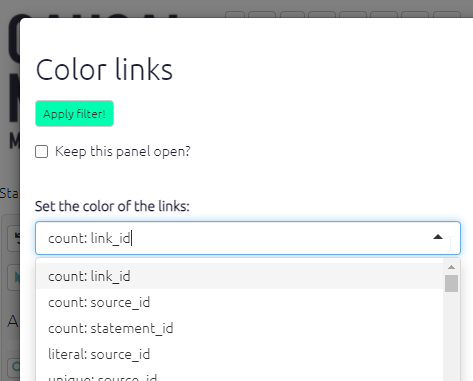{width=650}

For example, to label the links you can 

- count the number of links (`count: link_id`) 
- count the number of sources who mentioned a link (in a bundle of links with the same influence and confluence factors) (`count: source_id`)
- print the source_id for every link in a bundle of links (`unique: source_id`)
- print literally every source_id, including duplicates, on each link in a bundle of links (`literal: source_id`)
- count the number of villages in which this link was mentioned, assuming you have a field like village_id (`count: village_id`)

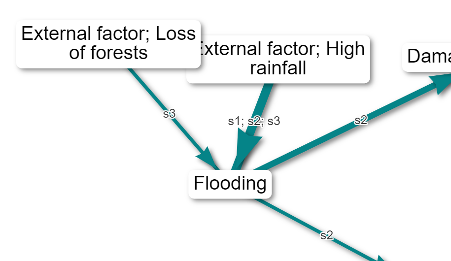{width=650}

(Here is an [example](causalmap.shinyapps.io/CausalMap2/?s=165) of labelling the links with the IDs of the sources. This can be very useful if you want to know if the same people who mentioned one link mentioned another.)

You can repeat this filter more than once - for example to label bundles of links by gender and by simple frequency: uncheck `Clear previous labels?`.

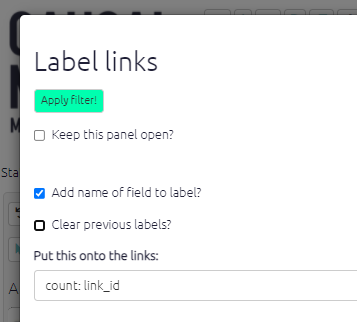{width=650}

You can also opt to add the name of the field to the label, so you could have a label like `Gender: Female, source_id: x12`.

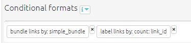{width=650}

Similarly you might want to colour your links with a continuous scale of colours according to:

- the total number of links (`count: link_id`) 
- the total number of sources who mentioned a link (in a bundle of links with the same influence and confluence factors) (`count: source_id`)

Or you might want to colour your links with a discrete scale of colours according to a non-numerical value:

- show a different colour for every source (`unique: source_id`)

The app works out for you if your scale is numerical or discrete, so you don't need to worry about that.

#### Initials{#xinitials}

Often it is useful to shorten the labels, for example you might have bundled your links by village and want to label the bundles with the names of the villages, but the village names are very long. Or you might have bundled your links by region and want to label the bundles with a list of the unique names of the villages in that region, but this might be quite a lot of text.  

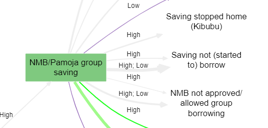

In this case you can use the function `initials`. 

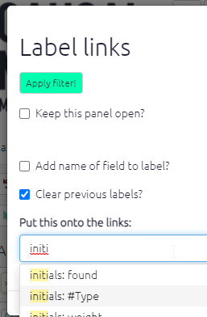

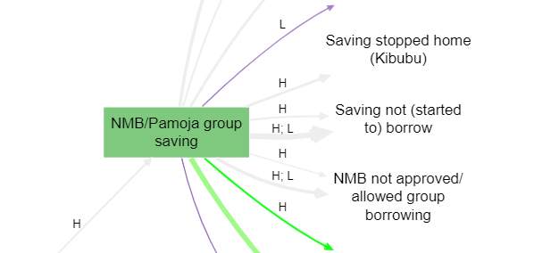

This is especially useful when you do [conditional formatting with surprise](#xsurprise).

## Conditional formatting for factors

### Colour text{#xcolour-text}

You can now conditionally colour the text of your factor labels. For example, this can be useful to draw attention to [factors which are opposites](https://causalmap.shinyapps.io/CM2test/?s=651):

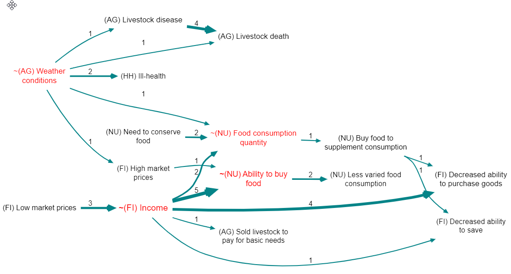

There is a dedicated shortcut button just for this:

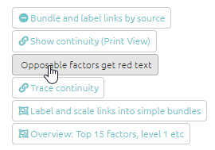

### Label factors{#xlabel-factors}

You can label your factors, as well as your [links](#xformattinglinks). Labelling your factors is a useful way of adding detail and clarity to your maps. Click on the label factors buttons to open up the filter panel. The app will then ask you to choose which label(s) to add to your l factors. Options include frequency, size, and zoom level.

Normally you will want to add this additional information to the existing factor label, but if you want you can check the box to `Clear previous labels?`

You can now also choose whether or not to include the name of the field in your factor labels.

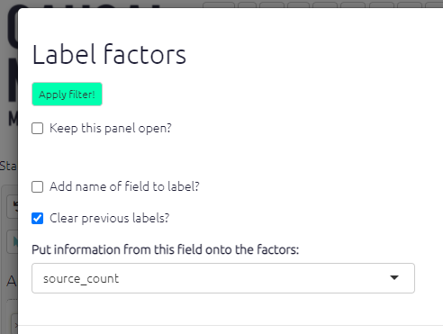


## Bundle links{#bundlelinks}

Similarly to bundling factors you can also bundle links. This is really helpful to keep your map neat and easy to read. To start with, you can simply bundle all the links between a pair of factors into the "simple bundle", represented as just one arrow; you will probably want to make the size or colour of this depend on the number of links in the bundle. 

Also, you can bundle the links between any pair of factors into more than one bundle, for example one bundle for each gender or  district. 

If your map is large the app will automatically apply this filter when you are viewing all statements. 

🧪 When you specify the field in the Advanced Editor, it is enough to only specify only part of the field name. Remember, this name matches any field associated with sources, links or statements. 

So `#2` will match  `#2-village-name`. We recommend marking your top few fields for analysis like gender etc., or whatever else interests you the most, not just with a leading `#` (this anyway marks out the field as important) but then with a number, like `#2`. This makes it easy to create reproducible filters which you can conveniently share across different files. 

The Standard Views which are available in the Dashboard also make use of this trick, offering you various views of the file which put these important fields through their paces.

## Colours

- if the field is numerical, the values of that field will be assigned to a colour gradient with the given low, medium and high colours. If you specify white or grey as the low point, the mid point will be ignored.
- otherwise, if the field is not numerical, the values of that field will be assigned random colours up to a maximum of eight.


### Fixed colours{#xfixed-colours}

Sometimes you might want to set a specific colour for all your factors, or links, or factor borders. This is a bit tricky to set using the buttons, but you can specify a colour easily using the advanced editor:

`color factors fixed=pink`
`color borders fixed=gray`
`color links fixed=coral`

You can use any [html colour](https://www.w3schools.com/colors/colors_names.asp) like red, pink, aliceblue, beige ... and also hex colours like #eee, #00000033 etc.

### Changing discrete palettes{#xdiscrete-palettes}

The [default palette for discrete fields like gender or village](https://colorbrewer2.org/#type=qualitative&scheme=Set1&n=9) is nice, but maybe you want something different. With continuous fields like source count, you can specify the high, low and mid colours; now you can change the palette for discrete fields too, by adding `pal=6` or  `pal=3` like this:

```
color links field = #area fun=literal pal=6
```

Palette 2 is a good choice if you don't like the paler colours in palette 1 (the default).See also the special sections on [conditional formatting with percentages](#percent) and [conditional formatting with surprise](#xsurprise).

Also, much of this formatting only makes sense in terms of bundles of links from one factor to another. The app will bundle the links for you in these cases.


## Calculated fields{#xcalculated-fields}

The app adds some pre-calculated fields for you and adds them to the tables. 

You can use these in various ways to construct filters. For example you can add `frequency` to your factor labels, or filter the map to show only bundles of links consisting of only one link (`find links field=source_frequency value=2 operator=less`).

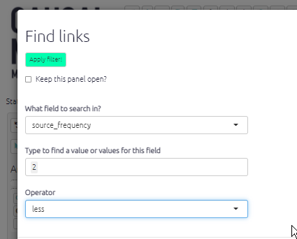{width=650}

Some examples of calculated fields:

### Links table

-  `simple_frequency` is just the number of links in each bundle
- `source_frequency` is the number of different sources in each bundle
- `simple_bundle` which is just the influence and consequence labels strung together like this: "influence / consequence".
- `before_id` gives the ids of any links immediately before the current link (i.e. which point *to* the factor at the *start* of the current link), and likewise for `after_id`. This information is useful when calculating source continuity.

### Factors table

-  betweenness: the number of paths going through the factor. Betweenness is a measure of how central a factor is in the map, how many paths go through it. Betweenness is similar to the frequency, but a factor with lots of links on the edge of the map will have a high frequency but won't have a high betweenness.
- betweenness_rank: the rank of the betweenness.
- in_degree: the number of incoming links.
- out_degree: the number of outgoing links.
- role: the number of incoming links minus the number of incoming links. High values are drivers, low values are outcomes
- frequency: the number of links.
-  driver_score: how strongly is this factor a driver? (driver_score=factors$out_degree-factors$in_degree * 2)
- outcome_score: how strongly is this factor an outcome?
- driver_rank: rank of driver_score.
- outcome_rank: rank of outcome_score.
- is_opposable: does the factor label contain a ~.
- zoom_level: number of ; separators in factor label, plus 1.
- top_level_label: the label of the factor's ultimate parent in the hierarchy, if any.
- top_level_frequency: the number of links to and from the top level factor.
- is_in_hierarchy: whether the factor is part of any hierarchy or is just a "singleton" factor.

You can use `is_in_hierarchy` to focus only on your hierarchical structure, eg you can add a filter 

`find factors field=is_in_hierarchy value=true operator=equals`

to exclude singletons.

### When combining opposites

When you combine opposites, the app gives you additional combined fields (in the links and factors tables) which you can use to display and filter your maps in various ways. For example, you can keep only links in which come from or to *positively* formulated factors: `find links field=flipped_bundle value=FALSE|FALSE operator=equals` . 


There are many more.

These fields are calculated at the start, so if you, say, filter for bundles with at least 10 links and then add filters which filter out, say, all the older people, you might get bundles with fewer links remaining. 
