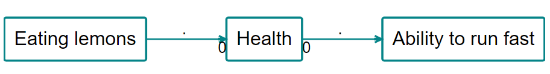

# Conditional formats

Conditional formats calculate and visualise information in your map.

The buttons in this section apply conditional formats to the map after it has (optionally) been transformed in the analysis section. Each filter can only be applied once, so when you click an inactive button in the bottom row it becomes active and moves to the top row, and when you delete it from the top row it appears again in the bottom row.

## Conditional formatting for links {#xformatting-links}

Conditional formatting gives you more options with links than with factors. It applies to:

- scale links
- colour links
- label links

When you click one of the buttons, you are asked how you want to colour, scale or label the links - the choices are the same. 

For example, to label the links you can 

- count the number of links (`count: link_id`) 
- count the number of sources who mentioned a link (in a bundle of links with the same influence and confluence factors) (`count: source_id`)
- print the source_id for every link in a bundle of links (`unique: source_id`)
- print literally every source_id, including duplicates, on each link in a bundle of links (`literal: source_id`)
- count the number of villages in which this link was mentioned, assuming you have a field like village_id (`count: village_id`)

(Here is an [example](causalmap.shinyapps.io/CausalMap2/?s=165) of labelling the links with the IDs of the sources. This can be very useful if you want to know if the same people who mentioned one link mentioned another.)

You can repeat this filter more than once - for example to label bundles of links by gender and by simple frequency: uncheck `Clear previous labels?`.

You can also opt to add the name of the field to the label, so you could have a label like `Gender: Female, source_id: x12`.

Similarly you might want to colour your links with a continuous scale of colours according to:

- the total number of links (`count: link_id`) 
- the total number of sources who mentioned a link (in a bundle of links with the same influence and confluence factors) (`count: source_id`)

Or you might want to colour your links with a discrete scale of colours according to a non-numerical value:

- show a different colour for every source (`unique: source_id`)

The app works out for you if your scale is numerical or discrete, so you don't need to worry about that.

See also the special section on [conditional formatting with percentages](#percent).

Also, much of this formatting only makes sense in terms of bundles of links from one factor to another. The app will bundle the links for you in these cases.

## Label factors{#xlabel-factors}

You can label your factors, as well as your [links](#xformattinglinks). Labelling your factors is a useful way of adding detail and clarity to your maps. Click on the label factors buttons to open up the filter panel. The app will then ask you to choose which label(s) to add to your l factors. Options include frequency, size, and zoom level.

Normally you will want to add this additional information to the existing factor label, but if you want you can check the box to `Clear previous labels?`

{width=650}

## Bundle links{#bundlelinks}

Similarly to bundling factors you can also bundle links. This is really helpful to keep your map neat and easy to read. To start with, you can simply bundle all the links between a pair of factors into the "simple bundle", represented as just one arrow; you will probably want to make the size or colour of this depend on the number of links in the bundle. 

Also, you can bundle the links between any pair of factors into more than one bundle, for example one bundle for each gender or  district. 

If your map is large the app will automatically apply this filter when you are viewing all statements. 

## Colours

- if the field is numerical, the values of that field will be assigned to a colour gradient with the given low, medium and high colours. If you specify white or grey as the low point, the mid point will be ignored.
- otherwise, if the field is not numerical, the values of that field will be assigned random colours up to a maximum of eight.

### Fixed colours{#xfixed-colours}

Sometimes you might want to set a specific colour for all your factors, or links, or factor borders. This is a bit tricky to set using the buttons, but you can specify a colour easily using the advanced editor:

`color factors fixed=pink`
`color borders fixed=gray`
`color links fixed=coral`

You can use any [html colour](https://www.w3schools.com/colors/colors_names.asp) like red, pink, aliceblue, beige ... and also hex colours like #eee, #00000033 etc.

## 🧪 Mark links for continuity (Print View only)

This filter is experimental and the details will certainly change. 

The [transitivity trap](#xtransitivity-trap) can make it a challenge to interpret your maps. Some people (or somebody) said that improved hygiene led to reduction in mosquito environments, and some people  said reduction in mosquito environments led to improved health, but *was this the same or different people*?

{width=650}

Add the filter `mark links` (there is no button for it, you have to type it) provides the following diagnostics:

{width=650}

The incoming (bundles of) links to every factor (actually to every factor with outgoing links) are labelled a, b, etc, including when links are bundled e.g. by gender. Then the outgoing links are marked with say `a` if at least one of the sources who mentioned the outgoing link also mentioned link `a`. 

So we can see that none of the people who said that improved hygiene led to reduction in mosquito environments also said that reduction in mosquito environments led to improved health: there is no label at all on the arrow going out of reduction in mosquito environments. There is no source continuity. 

Note that the labels get re-used for each factor, so the `a`s and `b`s here are related:

but the `a`s here are not:

This also works with all the other fields, e.g. you can type `mark links field=statement_id` in order to test statement continuity, which is a stricter test of continuity. source_id is default so you don't need to type it specially.

Yes, it is a bit difficult to communicate this in a report. But it is important for interpretation. Of course a chain without source continuity isn't an invalid chain per se, it's just something to be aware of. 

We will probably also add a simpler metric for outgoing links which does not distinguish between the incoming links, something like "Percentage of sources who mentioned a link leaving factor F who mentioned any of the links entering F". This metric could be used to colour or scale the links, or perhaps be printed on the tail of the links.

## 🧪 Show continuity

### Summary

Above, the links are labelled with the sources. 

The ▭ open half-box at the end of the first link tells us that at least half but not all of these stories stop here: less than half the sources mentioned any link *out of* K. 

The ◼ filled box at the start of the second link tells us that all of these stories are continuations: all these sources mentioned some link *into* K.

The  ▂ filled half-box at the end of the second link tells us that at least half but not all of these stories continue: Bob mentioned some link out of L, but Carla did not. 

The  ▢ open box on the link from L to N tells us that this story is not a continuation: Donna did not mention any link *into* L. 

There is no UI for this filter yet. You can just type

`show continuity`

in the advanced editor. 

----

If you want to look at say statement continuity rather than source continuity (the default), type

`show continuity field=statement_id`

If you want to see numbers (see examples below) rather than symbols (see examples further below; symbols are the default) then type:

`show continuity type=label`

Here, the 0.9 says that 90% of the sources mentioning the link to ~performed well also mention the link *from* ~performed well. The 1 says that 100% of the sources mentioning the link *from* ~performed well also mention the link *to* ~performed well. And the zeros below say that there is no source continuity at all. 

What this doesn't tell you is, when there are more than one incoming link, which of them have sources which continue to the outgoing link (that is what the bs and cs are for in `mark_links`). It's just an aggregate.

But what happens with filters which actually transform the map: zoom, bundle factors and combine opposites? Zoom can create its own version of the transitivity trap, if we [have](https://causalmap.shinyapps.io/CM2test/?s=415):

> eating lemons --> health; no scurvy

and

> health; fitness --> fast runner

we should be very careful when concluding (when zooming)

> eating lemons --> health --> fast runner

... and indeed, [showing continuity](https://causalmap.shinyapps.io/CM2test/?s=416) highlights this error: 

### Showing continuity with arrowtypes

Printing actual numbers (from 0 to 1) on the arrows can be very confusing. So the default is to use symbols. 

- white box: 0
- half white box: <= 0.5
- half full box: > .5
- full box: 1

{width=650}

## Calculated fields{#xcalculated-fields}

The app adds some pre-calculated fields for you and adds them to the tables. 

You can use these in various ways to construct filters. For example you can add `frequency` to your factor labels, or filter the map to show only bundles of links consisting of only one link (`find links field=source_frequency value=2 operator=less`).

Some examples of calculated fields:

### Links table

-  `simple_frequency` is just the number of links in each bundle
- 🧪 `source_frequency` is the number of different sources in each bundle
- `simple_bundle` which is just the influence and consequence labels strung together like this: "influence / consequence".
- `before_id` gives the ids of any links immediately before the current link (i.e. which point *to* the factor at the *start* of the current link), and likewise for `after_id`. This information is useful when calculating source continuity.

### Factors table

-  `frequency` aka "degree" is the total number of incoming and outgoing links.
-  Other network statistics
   -  `betweenness`
-  Fields for use with hierarchies:
   -  `top_level_label` which gives just the top level for each factor. 

### When combining opposites

When you combine opposites, the app gives you additional combined fields (in the links and factors tables) which you can use to display and filter your maps in various ways. For example, you can keep only links in which come from or to *positively* formulated factors: `find links field=flipped_bundle value=FALSE|FALSE operator=equals` . 

There are many more.

These fields are calculated at the start, so if you, say, filter for bundles with at least 10 links and then add filters which filter out, say, all the older people, you might get bundles with fewer links remaining. 
