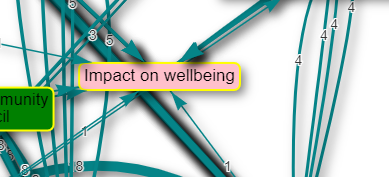

# Simple formats{#xsimple-formats}

These filters change basic visual elements of your map to make it clearer to interpret. The data itself is not affected.

```{r,echo=F}
knitr::include_url("https://player.vimeo.com/video/651173445")
```


## Fixed colours for all links, factors and factor borders

If you want to make all your factors, say, pink, just add the filter `color factors fixed=pink`

See [here](#xfixed-colours).

## Setting specific colours for links, factors and factor borders

If you want specific factors to have specific colours, for example "Impact on wellbeing" should always be pink, you can do this by roundtripping: 



- Create the columns `color.background` and/or `color.border` in the `factors` tab, and type any [colour names](https://www.w3schools.com/tags/ref_colornames.asp) you want (red, blue, pink, green etc) in this column in the row corresponding to the factors you want coloured. You can also use hexadecimal colours like `#eeff55`. 

This trick does not work with filters which manipulate the factor structure, if you zoom or combine opposites, as the app wouldn't know which colour you want. In this case, the colours applied in this way are unpredictable; you might want to restore standard colours eg just add the filter `color factors fixed=pink`.

## Wrap factor/link labels

Changing the wrap length of your labels can help make your map clearer and easier to read. As with other sliders, you might find it helpful to keep the filter panel open whilst you select your label length. Click on the wrap factor/link labels buttons to open their respective filter panels. Simply adjust the slider to your chosen length for your labels. 

We have now fixed various bugs with wrapping link and factor labels.

## Cluster factors{#xcluster-factors}

Sometimes you might want to visually show how factors in the map are similar to one another, without bundling them into one. By clustering similar factor labels, you can highlight similarities and/or differences in the way certain factors interact with other factors in the map without losing any of the details of your factor labels. For example, the screenshot below shows factors containing ‘Flood’ and ‘Damage’ clustered together, highlighting the link between flooding and damage.


Click on the cluster factors button to open the filter panel. Simply type in the word/phrase that the factors you want to be clustered contain. Once you click apply filter, all factors containing your chosen text will be positioned close to one another and surrounded by a grey box in the print view of the map. 


{width=650}


## Set print format

### Layout

The setting “layout” makes a huge difference. Usually you will want “dot” layout which lays out your map in a left-to-right direction. 

**Only the "dot" layout is fully supported.** However, **other layouts can be useful**, for example when you are looking just at the ego network for a single factor, i.e. just the factors immediately adjacent to it, searching just for that one factor and one step up or down, the “circo” layout can be very helpful. 

Beware that the output from other layouts may not look as good as the default "dot" layout, and the tweaks like setting horizontal separation may not work with them.

The screenshot below shows the circo print layout with 1 step up and 1 step down from Farm production.

**How do I use this filter?**

Click on the set print format button to open up the filter panel. There are various options for map layouts which you can try out. There is also a horizontal separation slider which you can adjust to select how far apart your factor labels are, if the number is higher your links will appear longer and your factor labels will be further apart. This is another filter where it would be helpful to keep the panel open so that you can see how your selections are affecting your map.


