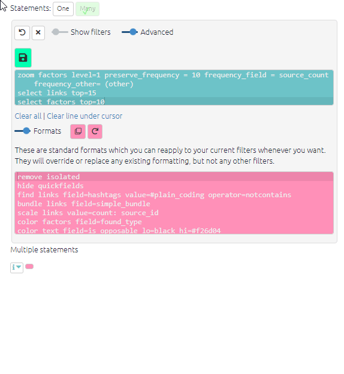
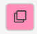
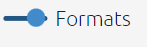
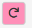

# Standard formats{#xstandard-formats}

Some kinds of formatting make sense to have switched on most of the time, such as bundling links together. It can be a bit tiresome to keep reapplying standard formatting. So Causal Map provides a set of standard formats which you can apply just by clicking on Apply Standard Formats  button.

All this does is paste those formats into the Advanced Editor, from where you can manipulate them with the buttons or directly in the Advanced Editor as you wish. You can reapply the standard formats at any time and they should overwrite most existing formatting. 

Also, you can view the standard formats by clicking this button and you are welcome to change them manually or add other formatting if you wish -- for example perhaps you just want all your links to be pink, so you can type or paste `color links fixed=pink` as an extra line in the Standard Formatting editor; and click on the Apply Standard Formats  button whenever you want to apply them. 

At the moment, these formats aren't saved between sessions, so if you have a favourite set of formatting filters, it's best to save the filter text somewhere outside the app.

Finally, if you've been tweaking the standard formats and want the defaults back again, click  Reload Standard Formats to get them back.

