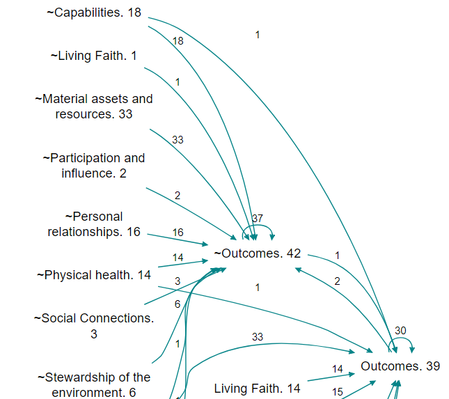
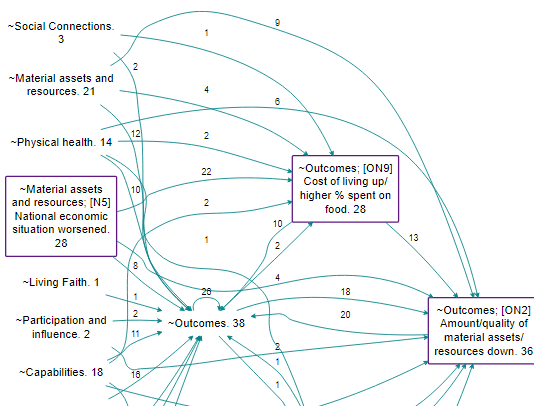
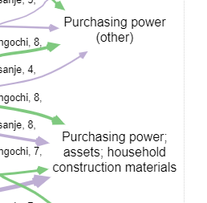

# 🧪Smart zooming

{width=650} 

Assuming we have a causal map which has used nested coding, as in the small map shown above, how do we take advantage of this coding to “zoom out”? 

Here is the same map, zoomed out to level 1 (i.e. there are no semi-colons at all).

{width=650} 

A weakness of hierarchical zooming is already visible in the example, so simplification goes one step further. In many cases we may be happy to see all the factors “rolled up” to the top level but in the above example, “Health behaviour; hand washing” dominates. “Health behaviour” itself is only mentioned once in the raw data, and there is only one other mention of it as a higher-level component, in relation to vaccinations. What can we do about this? 

Another way to simplify a causal map is just to hide factors and/or links which are mentioned less frequently. Often it is hard to view a full causal map, especially because of the presence of very many of what we could call “tiddlers”: factors with just one or two mentions. But this is unsatisfactory because it throws away information. This won’t help us, but can we combine the two approaches?

A smarter approach is achievable with this simple algorithm: only "roll up" a nested factor into a higher-level factor if it has a frequency (simple frequency, or source count) lower than some cut-off value; otherwise, keep it separate. 

This is an improvement over zooming because it retains detail where it is necessary and removes it where it is not. It will roll up lots of infrequent, granular factors into their parents but only if they are infrequent; if you have a very granular factor like "health behaviour; hand washing" which actually has a lot of mentions, then it won't get rolled up. 

The above example can be rolled up to this:

 {width=650}

This is an improvement because it still has a small number of factors, retaining frequently-mentioned factors but wrapping up infrequently-mentioned detail into higher-level concepts. 

This isn't available using the buttons yet but you can use the Advanced Editor. The code is:

```
zoom factors level=1 preserve_frequency = 5
```

You can use source_count instead:

```
zoom factors level=1 preserve_frequency = 5 frequency_field = source_count
```

There is also a shortcut button to insert the most common filter for you:


One thing which is not yet clear is whether the resulting pair of factors "Health behaviour" and "Health behaviour; hand_washing" should be distinguished in any way. For example, perhaps it isn't obvious, looking at "Health behaviour", that this higher-level factor *excludes* in this case its actual daughter,  "Health behaviour; Hand washing".

What the app does provide is the additional field in the factors table: `frequency preserved` . So if you want, you can highlight factors which are not rolled up, for example like this:

```
color borders field="frequency_preserved" hi=red lo=white
```

Here is a real-life example. 

A section of the top-level map, zoomed out to level 1 (source counts are shown)



And here is the same map but preserving factors with a source count above 20. This seems like a real improvement as some really concrete and important second-level factors are preserved, including for example the interesting link on the right between increased cost of living and amount of resources. We have chosen to highlight the preserved factors using a purple border.




Probably the best way to do this is to use the option `frequency_other= (other)`. This appends " (other)" (or whatever else you type) on to the ends of the higher-level factor labels which have child factors which are *not* rolled up, like this:


