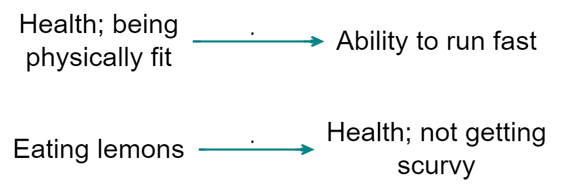

# Continuity and tracing threads{#xcontinuity}

## Summary

The [transitivity trap](#xtransitivity-trap) can make it a challenge to interpret your maps. Some people (or somebody) said that improved hygiene led to reduction in mosquito environments, and some people  said reduction in mosquito environments led to improved health, but *was this the same or different people*?

<!-- these need to stay full width or you cannot read them-->

You set the filter `trace threads` *after* a `trace paths` or `trace robustness` filter:

```
trace paths length=3 from=WASH information to=Improved health
trace threads
```

You can also trace threads downstream if you don't specify target factors (to = "anything"):

```
trace paths length=3 from=WASH information to=
trace threads
```

## Tracing threads (aka tracing continuity){#xtracing-threads}

If your map makes it look like Cash Transfer causally influenced Increased Wellbeing further downstream of it, you surely want to know if there are at least some sources who each mentioned the whole of one of the possible paths.  

We call this "tracing threads" as opposed to "tracing paths". So a thread is a chain of individual "original links" inside the bundles, whereas a path is just a chain of bundles, regardless of which sources mentioned each link.

Tracing threads is built on top of tracing paths. After you set a trace paths filter, you can then set a trace threads filter to look at the individual threads within the paths.

"Ah so there are plenty of paths from X to Y, but are there any threads? yes look, here is MXFG-1 who has a thread all the way down".

We can ask "how many threads make it all the way down to Improved Wellbeing"? The threads are named by the source ids, so we can say "Let's look at downstream thread MXFG-1".

When we are tracing threads, we can trace source threads, or village threads, or whatever. But usually we will trace in terms of sources, so if we do not specify which field defines the context, we assume we mean sources.

So a thread is a continuous chain of links with the same ID along a path. Within a bundle of links, each thread is one individual link associated with one ID (or sometimes, more than one link, if the ID mentioned that bundle more than once).

You set the filter `trace threads` *after* a `trace paths` or `trace robustness` filter. This creates the following calculated fields:

- Links fields
  - has_downstream_threads 
  - downstream_threads
- Factor field
  - downstream_threads_surviving

You can for example label the links like this `label links value=unique: downstream_threads`. 

You can for example colour the factors like this `color factors field=downstream_threads_surviving`. So if you set a filter to *trace threads downstream* from Cash Transfer C, imagine factor C is coloured completely red, and imagine a factor F immediately downstream of it being coloured with an intensity of red according to the number of sources which mentioned the link from C to F. In fact every factor downstream of C will be coloured with a shade of red in the same way. The central question of whether any source mentioned a whole path from C to, say, "Increased wellbeing" can be answered simply by seeing whether there is any red in the colour of "Increased wellbeing" or whether it is completely white. 

... So you can just look at C and watch its influence (in terms of source continuity) seeping downstream and spreading out along all source-complete paths.

It's like ink starting from C and flowing downstream as long as there is source continuity.

The direct counterpart, *tracing upstream threads* is not implemented yet. It asks about causes of effects rather than effects of causes: "Increased wellbeing" is completely red, and the redness of "Cash Transfer C" depends on the number of sources which mention a complete path from C to Increased wellbeing. 

Tracing paths anchors the filter to one or more factors, and if you use thread tracing to format an aspect of the map (e.g. to colour the links) then this formatting is only related to this specific set of origin and/or target factors and will change if you trace from and/or to different factors.


In this example, the width of the links reflects the number of sources mentioning it, but the colour of the links (and factors) reflects how many sources have  a continuous story starting from "Living in a refugee settlement" all the way up to that point. This difference is also shown in the pair of numbers on the links. So the top-right link was mentioned by one source, but the 0 shows that no single source mentioned a story all the way from "Living in a refugee settlement" which also includes this link.

## Advanced diagnostic filter: Mark links for continuity (Print View only)

*Showing* continuity aka "showing threads" is concerned with adjacent sets of links (or factors). It cannot be used to definitively answer questions about continuity down a longer path (actually, sometimes it does tell us something: if there is zero continuity on a section of a path with no splits, we know there is zero continuity down the longer path; but more generally, if there is some continuity down all the sections of a path, it does not mean that there is continuity down the whole of it).


Add the filter `mark links` (there is no button for it, you have to type it) provides the following diagnostics:

<!-- these need to stay full width or you cannot read them-->

The incoming (bundles of) links to every factor (actually to every factor with outgoing links) are labelled a, b, etc, including when links are bundled e.g. by gender. Then the outgoing links are marked with say `a` if at least one of the sources who mentioned the outgoing link also mentioned link `a`. 

So we can see that none of the people who said that improved hygiene led to reduction in mosquito environments also said that reduction in mosquito environments led to improved health: there is no label at all on the arrow going out of reduction in mosquito environments. There is no source continuity. 

Note that the labels get re-used for each factor, so the `a`s and `b`s here are related:

{width=650}

but the `a`s here are not:

{width=650}

This also works with all the other fields, e.g. you can type `mark links field=statement_id` in order to test statement continuity, which is a stricter test of continuity. source_id is default so you don't need to type it specially.

Yes, it is a bit difficult to communicate this in a report. But it is important for interpretation. Of course a chain without source continuity isn't an invalid chain per se, it's just something to be aware of. 

We will probably also add a simpler metric for outgoing links which does not distinguish between the incoming links, something like "Percentage of sources who mentioned a link leaving factor F who mentioned any of the links entering F". This metric could be used to colour or scale the links, or perhaps be printed on the tail of the links.

## Advanced diagnostic filter: Show continuity

Read on only if you are interested in advanced diagnostics!

### Summary

{width=650}

Above, the links are labelled with the sources. 

The ▭ open half-box at the end of the first link tells us that at least half but not all of these stories stop here: less than half the sources mentioned any link *out of* K. 

The ◼ filled box at the start of the second link tells us that all of these stories are continuations: all these sources mentioned some link *into* K.

The  ▂ filled half-box at the end of the second link tells us that at least half but not all of these stories continue: Bob mentioned some link out of L, but Carla did not. 

The  ▢ open box on the link from L to N tells us that this story is not a continuation: Donna did not mention any link *into* L. 

There is no UI for this filter yet. You can just type

`show continuity`

in the advanced editor. 

----

The four kinds of boxes are (possibly aggregated) indicators of continuity, with respect to sources, between stages in a path.

If you want to look at say statement continuity rather than source continuity (the default), type

`show continuity field=statement_id`

If you want to see numbers (see examples below) rather than symbols (see examples further below; symbols are the default) then type:

`show continuity type=label`

{width=650}

Here, the 0.9 says that 90% of the sources mentioning the link to ~performed well also mention the link *from* ~performed well. The 1 says that 100% of the sources mentioning the link *from* ~performed well also mention the link *to* ~performed well. And the zeros below say that there is no source continuity at all. 

What this doesn't tell you is, when there are more than one incoming link, which of them have sources which continue to the outgoing link (that is what the bs and cs are for in `mark_links`). It's just an aggregate.

But what happens with filters which actually transform the map: zoom, bundle factors and combine opposites? Zoom can create its own version of the transitivity trap, if we [have](https://causalmap.shinyapps.io/CM2test/?s=415):

> eating lemons --> health; no scurvy

and

> health; fitness --> fast runner

{width=650}

we should be very careful when concluding (when zooming)

> eating lemons --> health --> fast runner

... and indeed, [showing continuity](https://causalmap.shinyapps.io/CM2test/?s=416) highlights this error: 


{width=650}

### Showing continuity with arrowtypes

Printing actual numbers (from 0 to 1) on the arrows can be very confusing. So the default is to use symbols. 

- white box: 0
- half white box: <= 0.5
- half full box: > .5
- full box: 1

{width=650}

{width=650}

{width=650}

{width=650}


### Showing continuity with colours

https://causalmap.shinyapps.io/CM2test/?s=618

Using arrowheads gives you information about both upstream and downstream flows, but it can be a bit tricky to read. Instead you can use colours to display either downstream (effects of causes) or upstream (causes of effects) continuity. 


{width=650}

Here we see that not so many of the people who mentioned the link from business to income mentioned the link from purchasing power to business. 

Same, but upstream continuity:

{width=650}

https://causalmap.shinyapps.io/CM2test/?s=619

These values are set to 1 at the edges of the map where the metric has no meaning.

Note this is not the same as the non-causal question "how many of the people who mentioned factor C also mentioned factor E".

{width=650}

### More about these metrics


| Local Continuity | factors (simple)                                             | Factors (ego network)                                        |
| ---------------- | ------------------------------------------------------------ | ------------------------------------------------------------ |
|                  | overlap between sources who mentioned links to this factor and sources who mentioned links from this factor | overlap between sources who mentioned links to the causes of this factor and sources who mentioned links from the effects of this factor |
|                  |                                                              |                                                              |

And, with links:

| Local Continuity | Links                                                        |
| ---------------- | ------------------------------------------------------------ |
| Upstream         | overlap between sources who mentioned this link and sources who mentioned links to the cause of this link |
| Downstream       | overlap between sources who mentioned this link and sources who mentioned links from the effects of this link |


Each of these metrics can be expressed as a confusion matrix and can be cashed out as different ratios. We can therefore also interpret these metrics in terms of causal necessity and sufficiency. For example, above we can say that K is **causally sufficient** (with respect to sources) for M because all the sources who mention causes of M (along paths from K to M) also mention effects of K (along paths from K to M).

We need to say "with respect to sources" because all these ideas are generalisable to other fields such as, for example, village or question domain.

Because these metrics (confusion matrices) are defined in terms of source_id (or some other context-relevant link variable) they partly counter the problem with previous versions of these metrics in that they provide a denominator (number of sources) even if this has to be used with some care: as usual, the fact that source S does not mention link L does not mean they wouldn't assent to it, it may just not have appeared in the stochastic interview process. 


Many different metrics are possible. These (all?) also have corresponding non-causal counterparts as in QCA, for example:

| Local continuity (non-causal) | Factors (ego network)                                        |
| ----------------------------- | ------------------------------------------------------------ |
|                               | overlap between sources who mentioned the causes of this factor and sources who mentioned the effects of this factor |
|                               |                                                              |


These QCA-type metrics (confusion matrices) are inferior to their causal counterparts because they lose the information about what causes what and only use information about co-occurrence.

