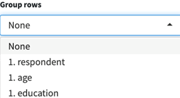

# Analysis: metrics

Many different metrics are possible for causal maps overall and for individual factors and links.

## 💻 Tables in the app{.hi .tabset}

There is a selection of tables included in the Tables panel. These tables can help to highlight key factors or differences across respondent groups, which can then be explored further in the causal maps. You can also apply the filters to these tables. 

```{r,echo=F}
show_mark("Interface/rightcard-tables-tab.md")
```

### How do I use the tables?

You can select from the available tables in the select table drop-down menu.


 

Simply turn on Apply filters for the table to use the filters you’ve selected or turn the toggle off for the table to show the entire dataset. 


When you type something in the Source Factor box, the map shows those hits but also factors connected them. In the Factors tables, you can hide these other factors by selecting "Show only factors?". 


Here are some other ways you can adjust the tables for a particular purpose or to suit your own preferences:

- By default, the factor tables display **frequency counts** (e.g. how many times a factor has been applied). However, you can choose to view **respondent counts** (e.g. how many people reported a factor) by switching on the Use source counts? toggle. 

 

- You can also group the rows in the factor tables to show how the data presented differs between various respondent characteristics such as age, education, and sex. Simply select the desired filter from the Group rows filter. 

 

- You can present the tables as a heatmap table by switching on the Use colours? Toggle. The higher the frequency of the count, the darker the colour of the cell will be. The table might take a few seconds to load when this toggle is turned on. 

 

- You can copy the data from the tables by clicking Copy table to clipboard. You can then paste the data in Word or Excel to create your own tables, graphs, or visualisations. You could also screenshot the table if you prefer! 

 

 

### Factors

What does this table show me? 

The factors table presents the factors applied during coding (and which are relevant for the current filters) and the number of times they were reported as an influence factor and/or a consequence factor. 

- From = how many times the factor was applied as an **influence** factor, i.e. leading to another factor. 

- To = how many times the factor was applied as a **consequence** factor, i.e. as a result of another factor. 

- The total represents how many times the factor was mentioned overall. 

- The factors are listed with the most frequent first. 

Why would I use this table?

This table is merely an overview which can help us to understand which factors are reported most frequently, and whether specific factors were more often cited as an influence or a consequence. To fully understand what the factors mean, they need to be seen in the context of the causal stories they appear in. This table can be useful for initial communication with the commissioner about which factor labels have been created and how often they have been applied, but do exercise caution when presenting this data as it only shows the factor in isolation, whereas QuIP is most interested in the relationships between factors. 

 

### Sample

What does this table show me? 

The sample table [without any filters applied] simply lists all of the respondents and any additional data collected about them (sex, age, location, education.) It also shows the interview type (individual or focus group) for each source. When filters are applied, the table will only present the relevant sources/respondents. If you are searching and filtering for a specific factor, this table will update and only show sources who reported that factor. 

Why would I use this table?

In the first instance, this table can be useful to check that all the sources have been imported into the app correctly. The table also provides a summary of the respondents which can be useful for presenting respondent demographics in the report, either in the sampling section or as an appendix. 

### Differences

What does this table show me?

This table is designed to be used alongside the search and filter functions. When you search and filter the map, the differences table will highlight any significant differences between respondent groups, e.g. more men than women reported a particular causal story. 

Why would I use this table?

Rather than comparing maps side by side, this function does the hard work for you by automatically assessing whether there are any significant differences between respondent groups. This is an incredibly valuable tool when seeking to understand whether particular interventions or alternative drivers/influences are affecting respondent groups differently. 

 

### Sections/questions

What does this table show me?

This table displays the text and ID for every question included in the questionnaire. It may also show any other additional data fields which are the same for each question, e.g. questionnaire subsection or question group. 

Why would I use this table?

You may wish to include this table as an appendix in your report or as a reference point for looking up particular questions. 

### QuIP-specific: Closed questions

What do these tables show me? 

There are two tables which provide a summary of the responses to the **closed questions** asked at the end of each QuIP questionnaire domain. The following symbols are used in the tables to represent the direction of change indicated by the response to the closed question:

| **Symbol** | **Direction  of change** | **Example  responses**          |
| ---------- | ------------------------ | ------------------------------- |
| **0**      | No change                | “No change” “Stayed the same”   |
| **+**      | Positive change          | “Better” “Improved” “Increased” |
| **-**      | Negative change          | “Worse” “Decreased”             |

 

The closed questions table gives an overview of how each **individual** respondent answered each closed question. The closed question summary table presents the **total respondent counts** for each direction of change. For every closed question you can see how many respondents reported positive, negative, or no change in that domain. You may wish to search and filter the statements to view only the closed question responses from a particular respondent group. 

Why would I use this table?

These tables provide a snapshot of the overall trends of change across the domains, so they can be a helpful introduction and “easing in” to the findings - before diving deeper into the causal stories! The closed question responses can also provide interesting insights when compared to the open-ended responses, especially in cases where they might differ. 

A full list of closed question responses can be found [here](https://drive.google.com/drive/folders/1wvifDQ0BXmAjSudTRUv9i_4JURpphD4v)
 

### QuIP-specific: Ranking 

What does this table show me?

This ranking table provides a summary of all the different organisations/individuals cited by respondents at the end of the questionnaire, along with their given ‘rank’. The table shows how many times different organisations were assigned a particular rank. You may wish to search and filter the statements to view only the organisational rankings from a particular respondent group. 

 

Why would I use this table?

This table is usually presented towards the end of the report to summarise the relative importance of the commissioner’s interventions in comparison to other actors. In some cases, this table serves as a reality check for organisations who may be unaware of the impact other actors are having in the lives of their intended beneficiaries. This table can show where there are duplicated efforts by different actors, and where there might be room for collaboration across organisations. 

 

