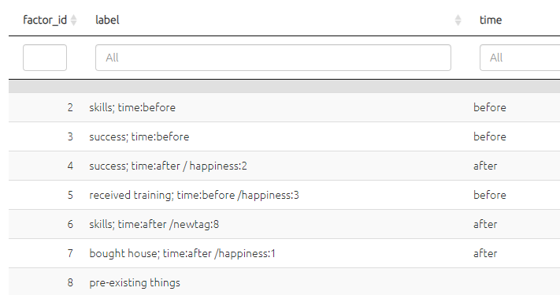
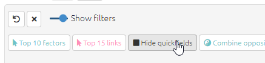
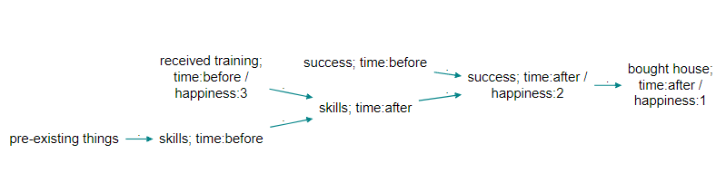
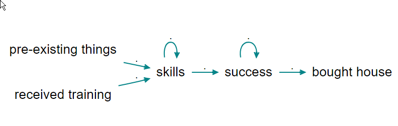

# Quickfields: analysis{#xquickfields-analysis}

## Summary

We already saw that [Quickfields](#xquickfields) are a special kind of [flag](#xflag) for factors and links. They are a *refinement* of flags for when you have a set of categories which is mutually exclusive.

You can add information about one or more dimensions using a format like this:

<u>Crops improved / time:before</u>

<u>Crops improved / time:after</u>

You can search for and display this information across all your tables and maps, not separately as they would be if you used ordinary flags like #before and #after, but together.

This feature is automatic and does not need to be switched on with any filter.

Quickfields can be hidden in labels using the `hide_quickfields` filter. This can provide a kind of zoom.

## Uses

- to search, filter, and organise the factors, links and mentions tables  
  - e.g. to summarise all the factors marked as `before` 

- to filter the map to show only factors marked as `before` . 
- to filter the map to exclude factors marked as `after`.
- to colour factor backgrounds, borders and/or text, or to scale the factors, according to the value of the quick field `time`.

If you  set numerical values e.g. `time:0`, `time:1`, `time:2` then the quick field `time` will be treated as numerical and so in particular continuous formatting for colours will be used e.g. a fade from red to blue.

## Quickfields are also ordinary flags

Quick field flags are still flags, so you can still *also* do all the things you would do with flags, for example search for "time:after" as a complete flag just as you would if it did not contain an `:` sign.

`find factors label contains time:after`

is equivalent to

`find factors time=after

## Hiding quickfields{#xhiding-quickfields}

Quickfields can be hidden in labels using the `hide quickfields` filter, 

to go from this:

{width=650}

to this:

{width=650}

Slashes and spaces and any leading semicolon will be removed.

## Current limitation

When you use filters which merge factors together (zooming and bundling factors) the values of quickfields for *any factors which are lost because they are nested into the higher levels* are not available.    

## 🧪Quickfields for links

Quickfields are now available for links too. 

