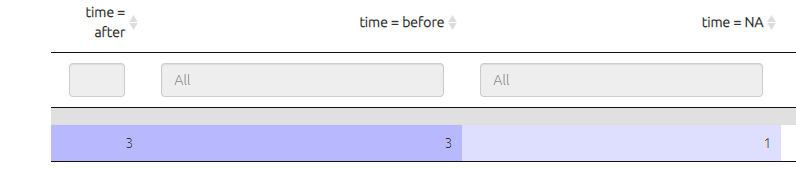
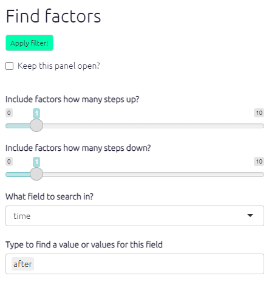

# Quickfields{#xquickfields}

## Summary

Quickfields are a special kind of [flag](#xflag) for factors and links. They are a *refinement* of flags for when you have a set of categories which is mutually exclusive.

You can add information about one or more dimensions using a format like this:

<u>Crops improved / time:before</u>

<u>Crops improved / time:after</u>

**A field (in this case, a field called `time`) will then be created in the factors table** which you can then use for example to filter the maps, to search, filter and organise the factors, links and mentions tables, and to format the maps.

Example uses:

- capturing time before/after
- capturing factors which are explicitly or implicitly attributed to a particular project
- capturing the valence of a factor e.g. when a subject explicitly says the liked or did not like the fact that they had more work
- capturing things which apply only, say, to girls or only to boys
- organising ideas within a hierarchy

You can search for and display this information across all your tables and maps, not separately as they would be if you used ordinary flags like #before and #after, but together.

This feature is automatic and does not need to be switched on with any filter.

Quickfields can be hidden in labels using the `hide_quickfields` filter. This can provide a kind of zoom.

## Uses

- to search, filter, and organise the factors, links and mentions tables  
  - e.g. to summarise all the factors marked as `before` 

- to filter the map to show only factors marked as `before` . 
- to filter the map to exclude factors marked as `after`.
- to colour factor backgrounds, borders and/or text, or to scale the factors, according to the value of the quick field `time`.

If you  set numerical values e.g. `time:0`, `time:1`, `time:2` then the quick field `time` will be treated as numerical and so in particular continuous formatting for colours will be used e.g. a fade from red to blue.

## Alternative formulations

These are equivalent, you can

<u>Crops improved time:after</u>

<u>Crops improved /time:after</u> (optionally use a / just to separate the fields visually)

or you can use a hanging flag:

<u>Crops improved; time:after</u> (a so-called "hanging flag" which is perhaps a bit more readable and moves the quick field to a lower level of the hierarchy).

## Quickfields are also ordinary flags

Quick field flags are still flags, so you can still *also* do all the things you would do with flags, for example search for "time:after" as a complete flag just as you would if it did not contain an `:` sign.

`find factors label contains time:after`

is equivalent to

`find factors time=after`

## Syntax

Quickfields must be composed only of letters and numbers, no punctuation or spaces. There must be no gap on either side of the colon (`:`).

## More than one quick field

You can combine more than one quick field at once:

<u>Crops improved / time:after / valence:2</u> (the / symbols here are not strictly necessary but improve readability.)

## Permanence

Quickfields become part of the factors table, you can even export them, but the values of the fields are always immediately overwritten if you change the labels. Values of fields derived from labels always take precedence, so there is no point roundtripping a quick field as it will be overwritten according to the labels. (You can always roundtrip other fields in the factors table which are not mentioned in the labels. So you can have a field called, say, `valence`, which is not mentioned in the factor labels in the form, say, `/ valence:high`).

## Hiding quickfields{#xhiding-quickfields}

Quickfields can be hidden in labels using the `hide quickfields` filter, 

to go from this:

{width=650}

to this:

{width=650}

Slashes and spaces and any leading semicolon will be removed.

## Position in hierarchy

Usually quickfields are put at the end the labels. This makes it easy to find and manipulate the factor labels in the Factor Editor. But quicklinks can appear anywhere in a label and in particular anywhere within a hierarchy:

<u>Anti-discrimination policy / theme:gender; disciplinary rules</u>

<u>Anti-discrimination policy / theme:race; awareness training</u>

This makes particular sense **when the lower levels of the hierarchy might differ** according to theme. Hierarchy and quickfields are a powerful combination.

## Current limitation

When you use filters which merge factors together (zooming and bundling factors) the values of quickfields for *any factors which are lost because they are nested into the higher levels* are not available.    

## 🧪Quickfields for links

Quickfields are now available for links too. You use the same syntax in the "hashtags" box.

## Quickfields for factor labels versus ordinary hashtags for links

It makes most sense to add dimensional information as described above when the distinctions are best understood as part of the causal structure, as part of the hierarchy of factors. For example:

- You want to express two or more different dimensions within your factor system at the same time, e.g. both *time* and *theme*. 
- There might be qualitative differences in the lower parts of the hierarchy, e.g.
  - Approach /sport:football; dealing with penalties
  - Approach /sport:swimming; different lengths 

On the other hand, you might prefer to use **link hashtags rather than quickfields** if: 

- The dimensions you want to record cut right across your entire factor system and don't apply to any particular part of it
- You want to combine the information with information from your sources table. For example, you might have a set of 20 documents, 5 on each of 4 countries, and so in your links table (transferred automatically from the sources table) you already have a field called, say, #country; but sometimes a report on one country, say, China, makes causal claims about a different country, say France. In this case, you might want to add a hashtag #country:France to these links. 
  - What should the app do in this case? Should it override the information in the #country column of the links table, which would have been `China` in this case, rewriting it as `France`?

